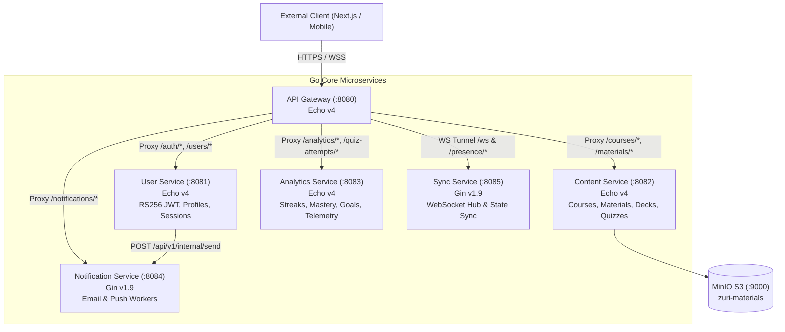
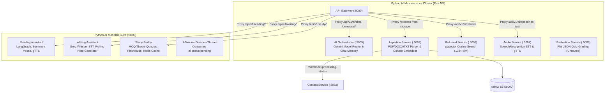
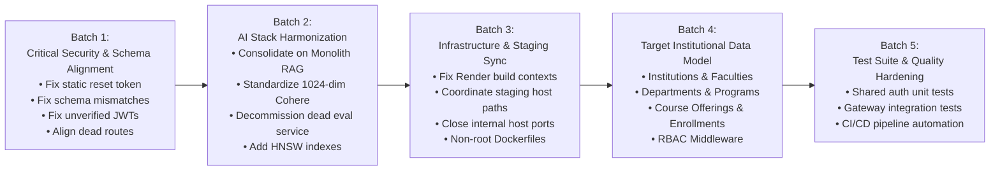

# Zuri Architecture & Codebase Audit (Batch 0: Reconnaissance)

**Document Version:** 1.0.0  
**Date:** September 16, 2026  
**Auditor:** Antigravity Autonomous Orchestrator (Agents A through H)  
**Target Repository:** `/workspaces/Backend_lexi`  
**Product Identity:** **Zuri** (Academic Institutional Intelligence System)  

---

## Table of Contents

1. [Executive Summary & Scope](#1-executive-summary--scope)
2. [Application Architecture Map](#2-application-architecture-map)
   - [2.1 Go Microservices Stack](#21-go-microservices-stack)
   - [2.2 Python AI Services Stack (Dual Architecture)](#22-python-ai-services-stack-dual-architecture)
   - [2.3 Shared Packages & Libraries](#23-shared-packages--libraries)
   - [2.4 Frontend Verification](#24-frontend-verification)
3. [Database Architecture & Entity Model](#3-database-architecture--entity-model)
   - [3.1 Technologies, Drivers & Pooling](#31-technologies-drivers--pooling)
   - [3.2 Migrations Trace: Canonical vs. Supabase](#32-migrations-trace-canonical-vs-supabase)
   - [3.3 Schema Namespace Mismatch Critical Flaw](#33-schema-namespace-mismatch-critical-flaw)
   - [3.4 Vector Retrieval & pgvector Schema](#34-vector-retrieval--pgvector-schema)
   - [3.5 Conceptual Data Model: Current B2C vs. Target Institutional Hierarchy](#35-conceptual-data-model-current-b2c-vs-target-institutional-hierarchy)
4. [Authentication, Authorization & Security Audit](#4-authentication-authorization--security-audit)
   - [4.1 RS256 Cryptographic Token Flow & Key Management](#41-rs256-cryptographic-token-flow--key-management)
   - [4.2 Critical Security Vulnerabilities](#42-critical-security-vulnerabilities)
   - [4.3 RBAC Status & Permissions Deficit](#43-rbac-status--permissions-deficit)
   - [4.4 Isolation & IDOR Vulnerability Analysis](#44-isolation--idor-vulnerability-analysis)
5. [AI Capabilities, Models, Prompts & Retrieval](#5-ai-capabilities-models-prompts--retrieval)
   - [5.1 Model Routing & Pricing Tiers](#51-model-routing--pricing-tiers)
   - [5.2 End-to-End Traces for Every AI Capability](#52-end-to-end-traces-for-every-ai-capability)
   - [5.3 Duplication Analysis: Microservices vs. Monolith](#53-duplication-analysis-microservices-vs-monolith)
   - [5.4 Caching, Deduplication & Rate Limiting Layers](#54-caching-deduplication--rate-limiting-layers)
6. [Product Feature Capability Mapping](#6-product-feature-capability-mapping)
   - [6.1 Full 12-Feature Capability Inventory](#61-full-12-feature-capability-inventory)
7. [Infrastructure, DevOps & Operational Resilience](#7-infrastructure-devops--operational-resilience)
   - [7.1 Containerization & Dockerfile Defects](#71-containerization--dockerfile-defects)
   - [7.2 Docker Compose Topology Discrepancies](#72-docker-compose-topology-discrepancies)
   - [7.3 Cloud Deployment Blueprint Defects (Render & Supabase)](#73-cloud-deployment-blueprint-defects-render--supabase)
   - [7.4 CI/CD Pipeline Analysis](#74-cicd-pipeline-analysis)
   - [7.5 Secrets Management & Exposure](#75-secrets-management--exposure)
8. [Dead Code, Route Reachability & Legacy Branding Audit](#8-dead-code-route-reachability--legacy-branding-audit)
   - [8.1 Stale Branding Inventory (Lexi / LexiAssist)](#81-stale-branding-inventory-lexi--lexiassist)
   - [8.2 Dead Gateway Routes (404 Triggers)](#82-dead-gateway-routes-404-triggers)
   - [8.3 Unreachable Upstream Endpoints](#83-unreachable-upstream-endpoints)
   - [8.4 Phantom & Obsolete Dependencies](#84-phantom--obsolete-dependencies)
9. [Testing Infrastructure & Quality Assessment](#9-testing-infrastructure--quality-assessment)
   - [9.1 Test Inventory & Quantitative Coverage](#91-test-inventory--quantitative-coverage)
   - [9.2 Highest-Risk Untested Surface Areas](#92-highest-risk-untested-surface-areas)
10. [Comprehensive Migration Risk Matrix](#10-comprehensive-migration-risk-matrix)
11. [Recommended Execution Roadmap (Batch 1 through Batch 5)](#11-recommended-execution-roadmap-batch-1-through-batch-5)

---

## 1. Executive Summary & Scope

This audit represents the comprehensive architectural, operational, and code-level reconnaissance (Batch 0) of the `/workspaces/Backend_lexi` repository. The objective is to establish an unshakeable empirical foundation for migrating the platform into **Zuri** — an enterprise-grade Academic Institutional Intelligence System.

### Scope of Investigation
- **Zero-Code-Modification Mandate**: This audit was strictly observational. No source code was refactored, no schemas were migrated, no routes were modified, and no legacy references were prematurely renamed.
- **Auditing Methodology**: Executed using 8 parallel sub-agents (Agents A through H) inspecting Application Architecture, Database & Migrations, Auth & Security, AI Pipelines, Infrastructure & DevOps, Feature Mapping, Dead Code & Branding, and Testing Infrastructure.
- **Repository Nature**: Confirmed strictly backend-only. The repository houses 6 Go microservices, 5 Python AI microservices, 1 Python AI monolith, infrastructure manifests, and documentation. No frontend source code resides within this repository.

---

## 2. Application Architecture Map

### 2.1 Go Microservices Stack



| Service Name | Port | Framework | Entry Point | Core Responsibilities |
| :--- | :--- | :--- | :--- | :--- |
| **API Gateway** | `8080` | Echo v4 | `services/gateway/cmd/main.go` | Central ingress, RS256 token verification, Redis sliding-window rate limiting, circuit breaker, reverse proxying, WebSocket tunneling. |
| **User Service** | `8081` | Echo v4 | `services/user/cmd/main.go` | User registration, authentication, RS256 token pair issuance, refresh token rotation, RSA key lifecycle, session tracking. |
| **Content Service** | `8082` | Echo v4 | `services/content/cmd/main.go` | Course and material catalogs, MinIO presigned uploads, quiz authoring, flashcard deck management. |
| **Analytics Service** | `8083` | Echo v4 | `services/analytics/cmd/main.go` | Quiz attempt state machine, scoring, topic mastery spaced repetition intervals, study streaks, learning goals progress engine. |
| **Notification Service** | `8084` | Gin v1.9 | `services/notification-service/main.go` | Asynchronous background workers for transactional SMTP emails and Firebase Cloud Messaging (FCM) device push notifications. |
| **Sync Service** | `8085` | Gin v1.9 | `services/sync-service/main.go` | Real-time WebSocket connection hub, multi-device presence tracking, change data capture (CDC) event logging and replay. |

### 2.2 Python AI Services Stack (Dual Architecture)

The system currently runs two parallel, overlapping AI implementations:



1. **AI Microservices Cluster (`zuri-Python Services/services/`)**:
   - **Orchestrator (`:5005`)**: Proxy to Gemini models (`gemini-2.5-flash-lite`, `gemini-2.5-flash`, `gemini-2.5-pro`) with cost tracking and conversation memory.
   - **Ingestion (`:5002`)**: Pulls files from MinIO, parses text via `pdfplumber`/`docx`, chunks into 500-word windows, embeds via Cohere `embed-multilingual-v3.0` (1024 dimensions), and stores in `ai.zuri_chunks`.
   - **Retrieval (`:5003`)**: Generates query embeddings via Cohere and performs cosine distance vector search on `ai.zuri_chunks`.
   - **Audio (`:5004`)**: Audio format conversion via ffmpeg/pydub, Google free STT, and Google Text-to-Speech (`gTTS`).
   - **Evaluation (`:5006`)**: Standalone quiz auto-grader reading/writing to local flat JSON files (`data/`).
2. **AI Monolith (`zuri-ai-main/`, port `:8000`)**:
   - Single FastAPI application registering sub-routers for Reading Assistant, Writing Assistant, and Study Buddy.
   - **Writing Assistant**: Streams real-time audio chunk transcriptions using **Groq Whisper** (`whisper-large-v3-turbo`) via SSE, then synthesizes structured markdown lecture notes using Gemini.
   - **Reading Assistant**: Runs compiled LangGraph state machines (`reading_graph`) to generate multi-tier summaries, extract academic vocabulary, generate in-memory `gTTS` audio, and store 768-dim Gemini embeddings in `ai.reading_document_chunks`.
   - **Study Buddy**: Generates multiple-choice and theory quizzes with rubrics, and creates flashcards with Redis caching (`@ai_cache`, 24h TTL).
   - **Background Worker (`worker.py`)**: Runs in-process daemon thread popping tasks from Redis queue `ai:queue:pending`.

### 2.3 Shared Packages & Libraries (`shared/pkg/*`)

- `shared/pkg/auth`: RS256 JWT validation and token generation, AES-256-GCM master-key encryption for private key storage, bcrypt password hashing.
- `shared/pkg/config`: Structured environment variable parser with strict mandatory validation (`Require`).
- `shared/pkg/database`: PostgreSQL GORM wrapper with connection pooling (`MaxOpenConns: 25`, `MaxIdleConns: 5`) and exponential backoff retry loop (5 retries).
- `shared/pkg/logger`: Structured JSON logging via Uber `zap`, injecting and extracting `X-Correlation-ID`.
- `shared/pkg/middleware`: Common Gin middlewares for auth validation, logging, and CORS.
- `shared/pkg/redis`: Redis v9 client wrapper providing sliding-window rate limiting, token caching, pub/sub, and streams.

### 2.4 Frontend Verification

- **Empirical Check**: Confirmed **zero frontend files** (no React components, Next.js routes, HTML templates, or `package.json`) exist in `/workspaces/Backend_lexi`.
- **Finding**: All frontend references in documentation (`docs/integration/`, `AGENTS.md`) describe an external client connecting over HTTPS/WSS to the Gateway on port `8080`.

---

## 3. Database Architecture & Entity Model

### 3.1 Technologies, Drivers & Pooling

- **Database Engine**: PostgreSQL 15 with `pgvector` extension (`pgvector/pgvector:pg15`).
- **Installed Extensions**: `uuid-ossp` (UUIDv4 generation) and `vector` (high-dimensional vector math). Missing `pg_trgm` and `btree_gist`.
- **Connection Management Matrix**:
  - `services/user`, `services/content`, `services/analytics`: Go 1.23 + GORM (`shared/pkg/database`), pool size 25, idle 5, retry with 2s doubling.
  - `services/notification-service`, `services/sync-service`: Go 1.23 + `sqlx` (`lib/pq`), default unbounded pooling, no connection retry logic.
  - `zuri-Python Services`: Python 3.11/3.12 + SQLAlchemy, pool size 5, max overflow 10. Falls back to local JSON files if database connection fails.
  - `zuri-ai-main`: Python 3.11 + SQLAlchemy. **Executes DDL at module import time** (`database.py:102-107`).

### 3.2 Migrations Trace: Canonical vs. Supabase

| File | Schemas & Entities Created | Details & Defects |
| :--- | :--- | :--- |
| `001_create_auth_schema.sql` | `auth`: `users`, `refresh_tokens`, `jwt_keys`, `password_resets`, `token_blacklist`, `user_sessions` | Core authentication schema with UUID primary keys. |
| `002_create_content_schema.sql` | `content`: `courses`, `materials`, `quizzes`, `quiz_questions`, `flashcard_decks`, `flashcards` | Personal catalog owned by individual `user_id`. |
| `003_create_analytics_schema.sql` | `analytics`: `quiz_attempts`, `quiz_answers`, `study_sessions`, `topic_mastery`, `ai_interactions`, `learning_goals` | Telemetry tables, topic mastery spaced repetition intervals, views for streak and performance summary. |
| `004_create_notification_schema.sql` | `notification`: `preferences`, `queue`, `history`, `scheduled_reminders` | Asynchronous notification queue and due reminder views. |
| `005_create_sync_schema.sql` | `sync`: `connections`, `events`, `device_state`, `change_log`, `presence` | State sync tables and online users view. |
| `006_create_ai_schema.sql` | `ai`: `session_type` ENUM, `user_sessions` | Stores reading, writing, and study sessions with `tts_audio_b64` blob column. |
| `007_add_role_column.sql` | Modifies `auth.users` | Adds `role` enum (`student`, `instructor`, `admin`, `super_admin`) and seeds initial admin. |
| `008_create_document_chunks.sql` | `ai`: `zuri_chunks` | Chunks table with `vector(1024)` column. **Omits vector HNSW/IVFFlat index.** |
| `009_update_learning_goals.sql` | Modifies `analytics.learning_goals` | Adds `current_value` and `goal_type`. **Defect**: Modifies `zuri_analytics` without check, crashing fresh Docker boots. |

### 3.3 Schema Namespace Mismatch Critical Flaw

- **The Split**:
  - Docker Compose mounts `infra/migrations/` to `/docker-entrypoint-initdb.d`, creating schemas: `auth`, `content`, `analytics`, `notification`, `sync`, `ai`.
  - However, **every Go microservice explicitly specifies `zuri_` prefixes** in its GORM table definitions and SQL queries:
    - User Service: `zuri_auth.users` (`services/user/internal/model/user.go:59`)
    - Content Service: `zuri_content.courses` (`services/content/internal/model/content.go:35`)
    - Analytics Service: `zuri_analytics.quiz_attempts` (`services/analytics/internal/model/analytics.go:39`)
    - Notification Service: `zuri_notification.preferences` (`services/notification-service/handlers/handlers.go:106`)
    - Sync Service: `zuri_sync.connections` (`services/sync-service/websocket/hub.go:399`)
- **Impact**: In a clean local environment initialized via `infra/docker-compose.yml`, all Go services immediately crash on boot with:
  `pq: relation "zuri_auth.users" does not exist (SQLSTATE 42P01)`.
  The `zuri_*` schemas only exist in the alternate `infra/migrations/supabase/*_zuri.sql` directory.

### 3.4 Vector Retrieval & pgvector Schema

Across the system, two incompatible vector schemas exist:
1. `ai.zuri_chunks`: Defined in `infra/migrations/008_create_document_chunks.sql`. Uses **1024-dimensional vectors** generated by Cohere `embed-multilingual-v3.0`. Queried by `services/retrieval` and `zuri-ai-main/zuricore.py`.
2. `ai.reading_document_chunks`: Defined only in `zuri-ai-main/database.py:77`. Uses **768-dimensional vectors** generated by Google Gemini `gemini-embedding-001`. **Has no SQL migration file.**
3. **Missing Vector Indexes**: Neither table possesses an HNSW or IVFFlat index. All similarity queries (`ORDER BY embedding <=> query_vector`) execute sequential full-table scans.

### 3.5 Conceptual Data Model: Current B2C vs. Target Institutional Hierarchy

The current data model is built entirely around an isolated individual student (B2C model):
- `courses` are personal notebooks owned by `user_id` (`UNIQUE(user_id, name)`).
- `materials`, `quizzes`, and `flashcard_decks` belong directly to `user_id`.
- There is zero institutional hierarchy or course sharing.

#### Target Institutional Hierarchy Gap Matrix

$$\text{Institution} \to \text{Faculty} \to \text{Department} \to \text{Program} \to \text{Level} \to \text{Course} \to \text{Course Offering} \to \text{Lecturer} \to \text{Enrollment} \to \text{Student} \to \text{Class/Lecture} \to \text{Material} \to \text{Assessment} \to \text{Learning Signal} \to \text{Knowledge}$$

| Tier | Institutional Concept | Current Codebase Status | Existing Field / Struct | What is Completely Missing |
| :---: | :--- | :---: | :--- | :--- |
| **1** | **Institution / University** | **MISSING** | `auth.users.school` (plain string) | Multi-tenant tenant entity, institution domains, institutional branding, campus isolation. |
| **2** | **Faculty / College** | **MISSING** | None | Faculty entity (e.g. Faculty of Science), dean associations, faculty governance. |
| **3** | **Department** | **MISSING** | `auth.users.department` (plain string) | Department entity, foreign key to faculty, department course catalogs. |
| **4** | **Program / Degree** | **MISSING** | None | Program entity (e.g. B.Sc. Computer Science), curriculum tracks, degree requirements. |
| **5** | **Level / Academic Year** | **MISSING** | `auth.users.academic_level` (string) | Level entity (100L, 200L, Year 1, Year 2), credit limits, prerequisite checks. |
| **6** | **Course (Catalog Entity)** | **MISMODELED** | `content.courses` | Modeled as private user folder. Missing master course catalog (e.g. `CSC 201`), credit units, syllabus outline. |
| **7** | **Course Offering / Section** | **MISSING** | Embedded `semester` / `year` strings | Semester instance separation (e.g. `CSC 201 - Fall 2026 Section A`), term enrollment windows, capacity limits. |
| **8** | **Lecturer / Instructor** | **MISSING** | `auth.users.role = 'instructor'` (enum) | Instructor profile entity, course offering assignment, TA roles, gradebook permissions. |
| **9** | **Enrollment** | **MISSING** | **None** | Enrollment linking `student_id` to `course_offering_id`, status (`enrolled`, `auditing`, `dropped`), grade tracking. |
| **10** | **Student** | **PARTIAL** | `auth.users.role = 'student'` | Student profile (matriculation number, admission cohort, advisor, GPA, declared major). |
| **11** | **Class / Lecture Session** | **MISSING** | None | Timetable schedule, lecture session topics, classroom links, attendance tracking. |
| **12** | **Material (Course Asset)** | **PARTIAL** | `content.materials` | Belongs to individual users instead of course offerings or syllabus lecture modules. |
| **13** | **Assessment / Exam** | **PARTIAL** | `content.quizzes` | Self-study quizzes only. No formal institutional exams, assignments, weightings, rubrics, or official gradebooks. |
| **14** | **Learning Signal** | **PARTIAL** | `analytics.study_sessions` | Self-study telemetry only. Missing institutional signals: lecture attendance, deadline compliance, drop-out risk. |
| **15** | **Knowledge Graph** | **PRIMITIVE** | `analytics.topic_mastery.topic` (string) | No concept ontology, prerequisite dependency DAG, learning outcome taxonomy, or syllabus topic tree. |

---

## 4. Authentication, Authorization & Security Audit

### 4.1 RS256 Cryptographic Token Flow & Key Management

- **Token Mechanism**: Asymmetric RSA-2048 signing (`jwt.SigningMethodRS256`).
- **Lifetimes**: Access tokens: 15 minutes (`ACCESS_TOKEN_TTL`), Refresh tokens: 30 days (`REFRESH_TOKEN_TTL`).
- **Key Storage**: RSA private keys are encrypted at rest using **AES-256-GCM** with a master key derived from `PRIVATE_KEY_ENCRYPTION_KEY`, stored in `zuri_auth.jwt_keys`.
- **Gateway Validation**: Gateway fetches the RSA public key over HTTP from `http://user-service:8081/api/v1/auth/public-key` at startup and validates tokens in memory.
- **Key Flaw**: Tokens do not include a `kid` (Key ID) header, preventing key rotation and caching across multiple active signing keys.

### 4.2 Critical Security Vulnerabilities

```
[CRITICAL VULNERABILITY: Static Password Reset Token]
File: services/user/internal/service/user_service.go:760-764

resetTokenBytes := make([]byte, 32)
// BUG: Never populated with rand.Read(resetTokenBytes)!
resetToken := auth.HashRefreshToken(string(resetTokenBytes))
```
- **Static Reset Token (Account Takeover)**: `resetTokenBytes` is initialized as a zero-filled byte slice (`\x00` $\times$ 32). The reset token is deterministic and identical for every account. Anyone who requests a password reset for any email can immediately submit `ResetPassword` with the static hash and take over the account.
- **Unverified JWT Signature Bypass in Notification & Sync Services**:
  - In `shared/pkg/middleware/auth.go:71-93`, fallback authentication executes `new(jwt.Parser).ParseUnverified` without verifying cryptographic signatures.
  - An attacker sending direct HTTP requests to Notification or Sync services can forge arbitrary JWTs with `user_id = admin` and bypass all authentication.
- **Complete Ineffectiveness of Token Blacklisting**:
  - In `services/user/internal/handler/auth_handler.go:176`, `accessTokenJTI` is hardcoded to `""`.
  - The Gateway never checks Redis or database blacklists. Revoked or logged-out access tokens remain valid until their 15-minute expiration.
- **Open Host Port Vulnerability in Docker Compose**:
  - `infra/docker-compose.yml` maps all backend service ports to `0.0.0.0` on the host (`8081`, `8082`, `8083`, `8084`, `8085`, `8000`, `5002-5006`).
  - Downstream Go services (`user`, `content`, `analytics`) trust incoming `X-User-ID` headers without verifying `X-Internal-Key`. Anyone with host network access can bypass the Gateway and spoof any user identity.

### 4.3 RBAC Status & Permissions Deficit

- Migration `007_add_role_column.sql` introduced roles: `student`, `instructor`, `admin`, `super_admin`.
- **Gateway Flaw**: Gateway's JWT claims struct (`services/gateway/internal/middleware/jwt.go:29-35`) omits `Role`. Gateway never reads user roles and never forwards an `X-User-Role` header downstream.
- **Handler Flaw**: There is **zero role enforcement** anywhere in downstream service handlers. Any student account can execute instructor or administrative endpoints.

### 4.4 Isolation & IDOR Vulnerability Analysis

- **Material & Quiz Course Binding IDOR**: `CreateMaterial`, `CreateQuiz`, and `CreateFlashcardDeck` in Content Service accept a `CourseID` without verifying that the authenticated user owns that course.
- **Nil-UUID Question Bug**: In `services/content/internal/service/content_service.go:572, 638`, `UpdateQuizQuestion` and `DeleteQuizQuestion` call `GetQuestionsByQuizID(ctx, uuid.Nil)`, failing all question updates and deletions.
- **Global Presence Leak**: `GET /api/v1/presence/online` returns all online users and their activity metadata across the entire database to any authenticated caller.

---

## 5. AI Capabilities, Models, Prompts & Retrieval

### 5.1 Model Routing & Pricing Tiers

Both `orchestrator/main.py` and `evaluation/main.py` define dynamic routing and cost tracking:
- **`gemini-2.5-flash-lite`** ($0.00010/1k in, $0.00040/1k out): Input < 1,500 characters, chat & short summaries.
- **`gemini-2.5-flash`** ($0.00030/1k in, $0.00250/1k out): Default balanced model for quizzes and standard prompts.
- **`gemini-2.5-pro`** ($0.00125/1k in, $0.01000/1k out): Prompts exceeding 15,000 characters.

### 5.2 End-to-End Traces for Every AI Capability

1. **Contextual Chat**: Client calls `POST /api/v1/ai/chat` ➔ Gateway rate-limits (20 RPM) & checks daily quota ➔ Proxies to Orchestrator `:5005` ➔ Injects top 5 chunks into academic persona prompt ➔ Calls Gemini with 429 retry ➔ Returns markdown answer and token cost.
2. **Quiz Generation**:
   - Microservice Path: `POST /api/v1/ai/generate/quiz` ➔ Orchestrator `:5005` generates 5 MCQs directly.
   - Monolith Path: `POST /api/v1/study/quiz` ➔ Gateway `aiHandler` forward-proxies multipart file to Monolith `:8000` ➔ LangGraph pipeline generates MCQs or Theory questions with marking rubrics, cached in Redis for 24 hours.
3. **Flashcard Generation**:
   - Microservice Path: `POST /api/v1/ai/generate/flashcards` ➔ Orchestrator generates 5 raw Q&A flashcards.
   - Monolith Path: `POST /api/v1/study/flashcards` ➔ Monolith LangGraph pipeline groups cards by topic with Redis deduplication.
4. **Material Ingestion & Vector Pipeline**:
   - Content Service presigns MinIO upload ➔ Client uploads file ➔ Ingestion Service (`:5002`) downloads file, parses text via `pdfplumber`/`docx`, chunks into 500-word windows with 50-word overlap, embeds via Cohere `embed-multilingual-v3.0` (1024 dimensions), persists to `ai.zuri_chunks`, and notifies Content Service via webhook.
5. **Reading Assistant (TTS & Summary)**:
   - `POST /api/v1/reading/analyse` ➔ Monolith LangGraph: 1. Stores 768-dim Gemini chunks in `ai.reading_document_chunks`; 2. Generates spoken-style summary; 3. Extracts academic vocabulary JSON; 4. Synthesizes MP3 audio via `gTTS` stored in `tts_audio_b64`.
6. **Writing Assistant (Live Audio & Notes)**:
   - `POST /api/v1/writing/transcribe` ➔ Monolith streams audio chunks to Groq Cloud (`whisper-large-v3-turbo`) returning live SSE tokens.
   - `POST /api/v1/writing/notes` ➔ Assembles transcript with rolling lecture context deque (size 20) and converts into formatted Markdown notes via Gemini 2.5 Flash.

### 5.3 Duplication Analysis: Microservices vs. Monolith

| Capability | Microservice Cluster (`zuri-Python Services`) | Monolith Suite (`zuri-ai-main`) | Verdict & Recommendation |
| :--- | :--- | :--- | :--- |
| **Quiz Generation** | `orchestrator/main.py:505` (basic JSON) | `study_buddy/quizzes.py` (MCQ + Theory + Rubric + Redis cache) | **Monolith superior**. Migrate Orchestrator route to Monolith logic. |
| **Flashcards** | `orchestrator/main.py:603` (flat 5 cards) | `study_buddy/flashcards.py` (Topic grouped + Redis cache) | **Monolith superior**. |
| **Speech-to-Text** | `audio/main.py:104` (Google free STT, high latency) | `writing_assistant/routes.py` (Groq Whisper, live SSE) | **Monolith Groq Whisper vastly superior**. Deprecate Audio STT. |
| **Text-to-Speech** | `audio/main.py:208` (`gTTS` to disk file) | `reading_assistant/tts_engine.py` (`gTTS` in-memory buffer) | Duplicate engine. Consolidate to in-memory streaming TTS. |
| **Vector Search** | `retrieval/main.py` (pure vector search, 1024-dim) | `zuricore.py:133` (Hybrid Search: pgvector + tsvector + RRF) | **Hybrid Search superior**. Consolidate to `zuricore.py` RRF algorithm. |

### 5.4 Caching, Deduplication & Rate Limiting Layers

- **Gateway Rate Limiting**: Redis sliding window. Normal endpoints: 100 RPM. AI endpoints: 20 RPM. Daily quota: 50 requests/day per user.
- **Gateway Deduplication**: Computes SHA-256 hash over payload (`middleware/ai_dedup.go`). Locks concurrent identical requests with a 5-minute processing key; caches 2xx responses in Redis for 24 hours.
- **Orchestrator In-Memory Cache**: 300-second TTL SHA-256 cache over `f"{model}:{prompt}"`.
- **Monolith Redis Cache**: `@ai_cache(namespace, ttl=86400)` with empty-result guards.

---

## 6. Product Feature Capability Mapping

### 6.1 Full 12-Feature Capability Inventory

```
+----+-----------------------+-----------------------------+------------------------------------+-----------------------------+--------------------------------------+
| #  | Feature Name          | Primary Service & Framework | Gateway Ingress Route              | Database Storage Entities   | AI Provider & Models                 |
+----+-----------------------+-----------------------------+------------------------------------+-----------------------------+--------------------------------------+
| 1  | Contextual Chat       | Orchestrator (FastAPI :5005)| POST /api/v1/ai/chat               | In-memory; analytics.ai_int | Gemini 2.5 Flash / Lite / Pro        |
| 2  | Quiz Generation/Taking| Content (:8082), Analytics  | POST /quizzes, /study/quiz         | content.quizzes, analytics.q| Gemini 2.5 Flash (Monolith)          |
| 3  | Flashcard Decks       | Content (:8082), Monolith   | GET/POST /flashcard-decks          | content.flashcard_decks     | Gemini 2.5 Flash (Monolith)          |
| 4  | Reading Assistant     | Monolith (FastAPI :8000)    | POST /api/v1/reading/analyse       | ai.user_sessions, reading_ch| Gemini 2.5 Flash, gTTS, Gemini Embed |
| 5  | Writing Assistant     | Monolith (FastAPI :8000)    | POST /api/v1/writing/transcribe    | ai.user_sessions            | Groq Whisper large-v3-turbo, Gemini  |
| 6  | Material Ingestion    | Ingestion (FastAPI :5002)   | POST /process-from-storage         | content.materials, zuri_chun| Cohere embed-multilingual-v3.0 (1024)|
| 7  | Course Catalog        | Content (Echo :8082)        | GET/POST /api/v1/courses           | content.courses, materials  | N/A (Relational Catalog)             |
| 8  | Analytics & Mastery   | Analytics (Echo :8083)      | GET /api/v1/analytics/study-streak | analytics.study_sessions, to| N/A (Telemetry & Spaced Repetition)  |
| 9  | Learning Goals Engine | Analytics (Echo :8083)      | GET/POST /api/v1/analytics/goals   | analytics.learning_goals    | N/A (Dynamic Goal Evaluation)        |
| 10 | Notifications Engine  | Notification (Gin :8084)    | GET/PUT /notifications/preferences | notification.preferences, qu| N/A (SMTP Email & Firebase FCM Push) |
| 11 | Sync & Real-Time      | Sync (Gin :8085)            | GET /api/v1/ws, /presence          | sync.connections, presence  | N/A (WebSocket Hub & CDC Logging)    |
| 12 | User Profile & IAM    | User (Echo :8081)           | POST /api/v1/auth/login, /users/me | auth.users, refresh_tokens  | N/A (RS256 JWT, bcrypt, AES-256-GCM) |
+----+-----------------------+-----------------------------+------------------------------------+-----------------------------+--------------------------------------+
```

---

## 7. Infrastructure, DevOps & Operational Resilience

### 7.1 Containerization & Dockerfile Defects

- **Security Hazard (Root Execution)**: 11 out of 12 Dockerfiles run as unprivileged `root`. The only container attempting non-root execution (`services/user/Dockerfile`) copies binaries into `/root/`, causing permission errors under standard container runtimes.
- **Go Image Discrepancy**: All 6 Go Dockerfiles reference `golang:1.25-alpine` (a future/unreleased version), whereas `go.mod` specifies Go 1.23.
- **Build Cache Flaw**: `services/content/Dockerfile` and `services/analytics/Dockerfile` copy `go.mod` without `go.sum` before running `go mod download`, breaking cache invalidation.
- **Missing Healthchecks**: 10 of 12 Dockerfiles lack container-level `HEALTHCHECK` instructions.

### 7.2 Docker Compose Topology Discrepancies

- `infra/docker-compose.yml`: Primary stack with 15 containers. Host port exposure allows bypassing Gateway.
- `infra/docker-compose.core.yml`: Uses plain `postgres:15-alpine` without pgvector or migrations, rendering it non-functional for local development.
- `infra/docker-compose-full.yml`: Hardcodes a dummy `PRIVATE_KEY_ENCRYPTION_KEY` and sets `AI_ORCHESTRATOR_URL` to port 5000 instead of 5005.

### 7.3 Cloud Deployment Blueprint Defects (Render & Supabase)

- **Fatal Build Context Defect in Render Blueprints**:
  In both `render.yaml:260-333` and `infra/deploy/render-supabase.yaml:265-343`, Python microservices set:
  ```yaml
  dockerfilePath: ./zuri-Python Services/services/orchestrator/Dockerfile
  dockerContext: ./zuri-Python Services/services/orchestrator
  ```
  The Dockerfile attempts to copy `requirements-final.txt` from the context root. Because that file is in `./zuri-Python Services/`, Render builds immediately fail with `file not found`.
  **Remedy**: Update `dockerContext: ./zuri-Python Services` across all 5 Python services.

### 7.4 CI/CD Pipeline Analysis

- `.github/workflows/deploy-staging.yml`: Triggers on push to `main` and deploys via SSH.
- **Gaps**:
  - No automated pull request validation pipeline.
  - No automated `go test`, linter, or syntax verification before deploying.
  - Hardcoded legacy directory path `/opt/lexiassist/backend` on remote host.
  - Healthcheck step queries legacy domain `https://staging.lexiassist.app/health`.

### 7.5 Secrets Management & Exposure

- RS256 private keys are encrypted with AES-256-GCM before DB insertion.
- Multiple files retain fallback secrets: `INTERNAL_API_KEY = "dev-internal-key"`, `PRIVATE_KEY_ENCRYPTION_KEY = "your-secure-master-key-min-32-chars-long"`.
- Missing `.env.example` in `infra/`.

---

## 8. Dead Code, Route Reachability & Legacy Branding Audit

### 8.1 Stale Branding Inventory (Lexi / LexiAssist)

All occurrences of legacy naming have been cataloged:

| # | File Path & Line Number | Exact Snippet | Classification | Safe to Rename? / Risk Assessment |
| :--- | :--- | :--- | :--- | :--- |
| 1 | `.github/workflows/deploy-staging.yml:21` | `cd /opt/lexiassist/backend` | Runtime-critical | **HIGH RISK.** Remote SSH server directory. Coordinate with staging server before editing. |
| 2 | `.github/workflows/deploy-staging.yml:34` | `https://staging.lexiassist.app/health` | Runtime-critical | **HIGH RISK.** Health check domain. Must update after DNS/nginx routing is aligned. |
| 3 | `README.md:338` | `Backend_lexi/` | Documentation | **SAFE.** Directory structure diagram. |
| 4 | `README.md:382, 383` | `file:///workspaces/Backend_lexi/...` | Documentation | **SAFE.** Replace with relative links. |
| 5 | `docs/README.md:10-25` | `file:///workspaces/Backend_lexi/...` | Documentation | **SAFE.** Replace 10 absolute links with relative links. |
| 6 | `.git/config:7` | `url = .../Marvellousik/Backend_lexi` | Git Config | **CAUTION.** Local git origin remote. |
| 7 | `.git/config:16` | `url = .../LexiAssist/Backend.git` | Git Config | **HISTORICAL.** Upstream git remote tracking. |
| 8 | `zuri-ai-main/api.py:35` | `title="EdTech AI API"` | User-visible | **SAFE.** OpenAPI title. Update to `"Zuri AI API"`. |

### 8.2 Dead Gateway Routes (404 Triggers)

The following routes on API Gateway proxy to non-existent upstream endpoints:
1. `POST /api/v1/webhooks/material-uploaded` ➔ Content Service has no such route.
2. `POST /api/v1/quizzes/:id/submit` ➔ Analytics Service handles submissions via `/quiz-attempts/:id/answers`.
3. `GET /api/v1/analytics/quiz-history` ➔ Analytics Service provides `/quiz-attempts`.
4. `GET/POST /api/v1/sync/events` ➔ Sync Service registers `/api/v1/events` (without `/sync`), producing a 404.

### 8.3 Unreachable Upstream Endpoints

- **Content Service**: 11 CRUD endpoints (`PUT/DELETE /quizzes/:id`, `/quizzes/:id/questions`, `/flashcard-decks/:id/cards`) exist in Go code but are never exposed by the Gateway.
- **Sync Service**: `/api/v1/internal/broadcast` and `/api/v1/internal/changes` are never called.
- **AI Microservices**: Orchestrator streaming chat (`/api/v1/ai/chat/stream`), Ingestion `/process`, and Audio `/text-to-speech` are omitted from the Gateway.

### 8.4 Phantom & Obsolete Dependencies

- Python: `Django==6.0.2` and `Celery==5.6.2` are pinned across all requirements files but never imported.
- `weaviate-client==4.20.4` and `google-cloud-texttospeech==2.34.0` in `zuri-ai-main/requirements.txt` are obsolete remnants.
- Redundant requirements files: Dockerfiles copy only `requirements-final.txt`, leaving other requirements files dead.

---

## 9. Testing Infrastructure & Quality Assessment

### 9.1 Test Inventory & Quantitative Coverage

- **Repository Test Coverage**: **Critically low (< 5%)**.
- **Existing Go Tests**:
  - `services/user/internal/service/user_service_test.go`: Unit tests for User Service.
  - `services/gateway/internal/proxy/reverse_proxy_test.go`: Unit tests for reverse proxy header cleaning.
- **Existing Python Tests**:
  - `tests/integration/integration_test_phase1_phase2.py`: Single ad-hoc integration script relying heavily on monkey-patching `sys.modules`. No pytest runner configured.
- **Zero-Coverage Services**:
  - 4 Go services have **0% coverage**: `content`, `analytics`, `notification-service`, `sync-service`.
  - All shared Go libraries in `shared/pkg/` (`auth`, `redis`, `database`, `middleware`) have **0% coverage** — including token validation, password hashing, and AES key encryption.
  - All Python services (`orchestrator`, `ingestion`, `retrieval`, `audio`, `evaluation`, `zuri-ai-main`) have **0% automated test coverage**.

### 9.2 Highest-Risk Untested Surface Areas

1. `shared/pkg/auth`: RS256 token verification, claims validation, AES-256-GCM encryption at rest.
2. `services/content`: File upload presigning and processing status state machine.
3. `services/analytics`: Quiz scoring calculations and topic mastery intervals.
4. `services/gateway`: Rate limiting and circuit breaking failure logic.

---

## 10. Comprehensive Migration Risk Matrix

| Risk ID | Risk Description | Severity | Probability | Blast Radius | Mitigation Strategy |
| :---: | :--- | :---: | :---: | :---: | :--- |
| **R-01** | Account takeover via static password reset token (`\x00` $\times$ 32). | **CRITICAL** | High | Entire User Identity Layer | Patch `user_service.go:760` with `crypto/rand.Read` in Batch 1. |
| **R-02** | Schema mismatch (`auth` vs `zuri_auth`) crashing fresh DB boots. | **CRITICAL** | High | All Go Microservices | Unify schemas across migrations and models in Batch 1. |
| **R-03** | Unverified JWT parsing in Notification and Sync services. | **CRITICAL** | Medium | Internal Event Infrastructure | Remove `ParseUnverified`; validate `X-Internal-Key` in Batch 1. |
| **R-04** | Incompatible vector embeddings (1024-dim Cohere vs 768-dim Gemini). | **HIGH** | High | RAG, Search & Reading Assistant | Standardize on a single embedding dimension in Batch 2. |
| **R-05** | Missing vector indexes causing full sequential table scans. | **HIGH** | High | Database Performance Under Load | Add HNSW vector indexes to migration scripts in Batch 1. |
| **R-06** | Open host ports in Docker Compose allowing Gateway bypass. | **HIGH** | Medium | Multi-Tenant Data Isolation | Remove host port bindings from downstream services in Batch 1. |
| **R-07** | Dead Gateway routes causing 404 errors on user submissions. | **MEDIUM** | High | Quiz Submission & Material Upload | Align Gateway routes with active service endpoints in Batch 1. |
| **R-08** | Render deployment failure due to invalid Python build context. | **MEDIUM** | High | Cloud Production Deployments | Correct `dockerContext` in `render.yaml` in Batch 1. |
| **R-09** | Broken question updates due to `uuid.Nil` bug in Content Service. | **MEDIUM** | High | Quiz Editing & Content Authoring | Fix repository call in `content_service.go` in Batch 1. |
| **R-10** | Staging deployment break if `/opt/lexiassist` is renamed without host sync. | **MEDIUM** | High | Staging CI/CD Pipeline | Coordinate host directory rename prior to modifying workflow in Batch 3. |

---

## 11. Recommended Execution Roadmap (Batch 1 through Batch 5)



### Batch 1: Critical Security, Schema Alignment & Route Fixes
- Fix static password reset token generation in `user_service.go`.
- Resolve `auth` vs `zuri_auth` schema namespace mismatch across migrations and GORM models.
- Remove `ParseUnverified` JWT fallback in `shared/pkg/middleware/auth.go`.
- Fix dead Gateway routes (`/quizzes/:id/submit`, `/analytics/quiz-history`, `/sync/events`).
- Fix `uuid.Nil` question update/delete bug in Content Service.
- Add `Role` claim to Gateway JWT validation and forward `X-User-Role`.

### Batch 2: AI Stack Harmonization & Retrieval Consolidation
- Consolidate dual AI stacks: adopt Monolith LangGraph pipelines for quizzes, flashcards, and Groq Whisper STT.
- Standardize all vector retrieval on 1024-dimensional Cohere embeddings in `ai.zuri_chunks`.
- Decommission dead `evaluation-service` and prune phantom dependencies (`Django`, `Celery`, `weaviate-client`).
- Create explicit migration for missing `reading_document_chunks` table and add HNSW vector indexes.

### Batch 3: Infrastructure, Staging Host Sync & Container Hardening
- Fix `dockerContext` in `render.yaml` and `render-supabase.yaml`.
- Coordinate staging host directory rename from `/opt/lexiassist/backend` to `/opt/zuri/backend`, then update `.github/workflows/deploy-staging.yml`.
- Standardize Go base images to `golang:1.23-alpine` and switch containers to non-root users.
- Close downstream service host ports in production/staging Docker Compose.
- Restore `infra/.env.example`.

### Batch 4: Institutional Domain Model Migration (The Core Migration)
- Design and execute migration for Institutional Data Model: `institutions`, `faculties`, `departments`, `programs`, `academic_levels`, `course_offerings`, and `enrollments`.
- Refactor `content.courses` from personal user folders to institutional course catalogs.
- Implement RBAC authorization middleware enforcing `student`, `instructor`, `admin`, and `super_admin` permissions.

### Batch 5: Test Infrastructure & CI Automation
- Implement comprehensive test suites for `shared/pkg/auth`, `services/content`, and `services/analytics`.
- Establish GitHub Actions CI workflow running `go test`, `golangci-lint`, and `scripts/check_syntax.py` on pull requests.
