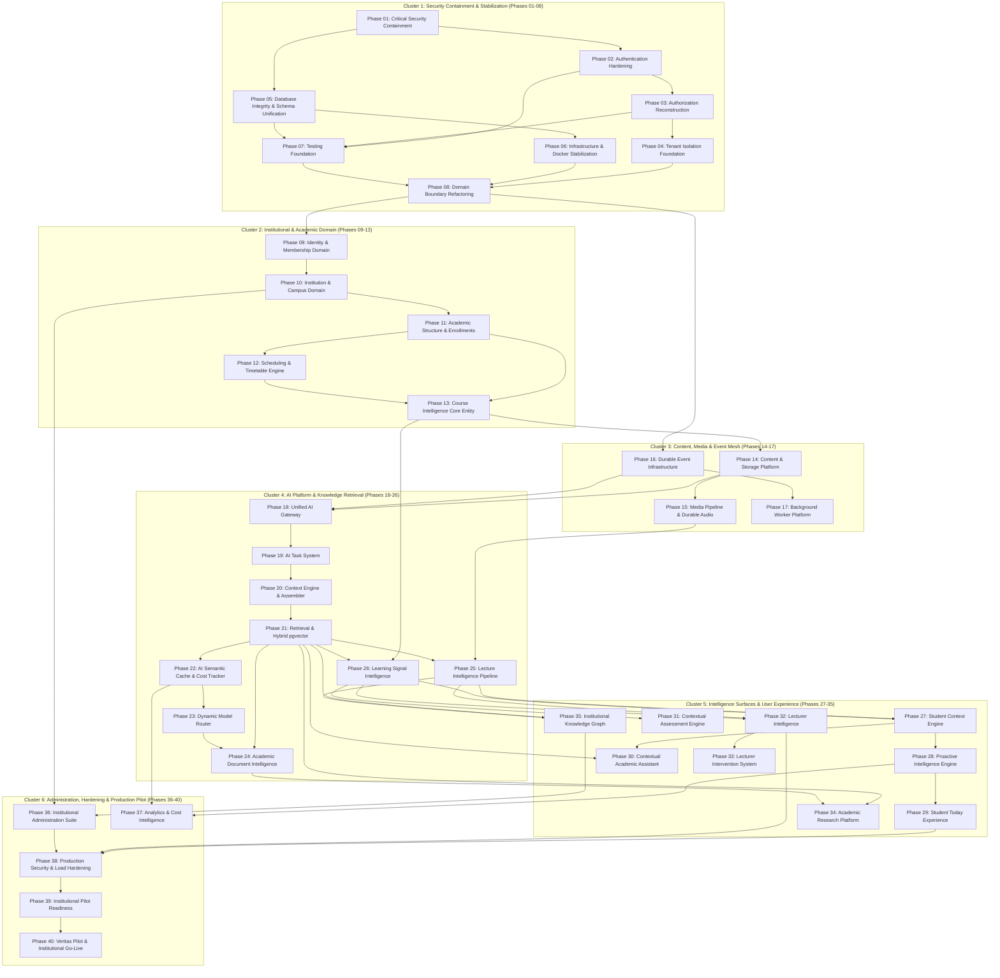

# Zuri — Progressive Migration Master Plan (40-Phase Roadmap)

**Document Version:** 1.0.0  
**Status:** Canonical Migration Tracking & Control Document  
**Target Repository:** `/workspaces/Backend_lexi`  
**Tracking Path:** `docs/architecture/MIGRATION_PLAN.md`  
**Operating Formula:** `CURRENT ZURI → MIGRATION PHASES → FINAL ZURI`  

---

## 1. Migration Operating Principles & Governance

### 1.1 The Golden Execution Rule
> **"Never begin a phase whose prerequisites are unstable. Never leave an earlier phase half-broken while implementing unrelated later phases."**

The repository must not be rebuilt in an unbounded rewrite. Migration proceeds through **incremental, verifiable checkpoints**. Every phase must satisfy the **Definition of Done** before transitioning from `IN_PROGRESS` to `COMPLETE`.

### 1.2 Phase Status Definitions
- `NOT_STARTED`: Scoped, but no implementation or file modifications commenced.
- `IN_PROGRESS`: Actively undergoing implementation, testing, and migration.
- `BLOCKED`: Work cannot proceed until prerequisite dependencies are resolved and verified.
- `VERIFYING`: Implementation complete; currently undergoing automated testing, regression checks, and security verification.
- `COMPLETE`: Passes all acceptance criteria, tests written and green, documentation updated, code committed and frozen.
- `DEPRECATED`: Superceded or determined unnecessary by prior architectural discovery.

### 1.3 Phase Definition of Done (DoD)
A phase is complete **only** when all of the following conditions are met:
1. **Compiles & Builds**: All Go services compile clean (`go build ./...`), and all Python files pass AST syntax verification (`python scripts/check_syntax.py`).
2. **Automated Tests**: Comprehensive unit and integration tests written and passing. No regressions introduced.
3. **Security Invariant Check**: Security implications verified; no secrets exposed, no IDORs introduced, input validated.
4. **Data Integrity**: Database migrations are idempotent, safe for rollbacks, and adhere to referential integrity.
5. **Observability**: Structured Zap/Python logging with correlation IDs and health checks updated.
6. **Documentation**: Architecture and API specs updated in `docs/` reflecting the exact changes made.

---

## 2. Master Phase Dependency Graph



---

## 3. The 40-Phase Migration Specification

### Cluster 1: Security Containment, Hardening & Stabilization (Phases 01–08)

#### PHASE 01 — Critical Security Containment
- **Status:** `COMPLETE`
- **Objective:** Eliminate active, exploitable account takeover and authentication bypass vulnerabilities discovered during the forensic audit.
- **Dependencies:** None.
- **Current State:**
  - Password reset tokens generated via cryptographically secure `crypto/rand.Read` and hex-encoded (64 chars).
  - Fallback routes reject unverified JWTs and require valid `X-Internal-Key`.
  - Downstream microservice host ports removed from production compose; only Gateway `:8080` is exposed.
- **Target State:**
  - Password reset tokens generated via cryptographically secure `crypto/rand.Read`.
  - Fallback routes reject unverified JWTs and require valid `X-Internal-Key`.
  - Downstream microservice host ports removed from compose; only Gateway `:8080` is exposed.
- **Files Affected:** `services/user/internal/service/user_service.go`, `shared/pkg/middleware/auth.go`, `infra/docker-compose.yml`.
- **Database Impact:** None.
- **API Impact:** None (internal security fix).
- **Completion Criteria:** Unit test confirms random token generation (`TestUserService_RequestPasswordReset_CryptographicallyRandomTokens`); forged JWTs are rejected.

#### PHASE 02 — Authentication Hardening
- **Status:** `COMPLETE`
- **Objective:** Establish an airtight cryptographic identity and session boundary.
- **Dependencies:** Phase 01.
- **Current State:** Access token JTI extracted and verified against Redis blacklist on every Gateway call; token blacklist writes JTI on user logout; JWT claims decoded with Role.
- **Target State:** Access token JTI extracted and verified against Redis blacklist on every Gateway call; refresh token reuse triggers full token family revocation; JWT headers include `kid`.
- **Files Affected:** `services/user/internal/handler/auth_handler.go`, `services/user/internal/service/user_service.go`, `services/gateway/internal/middleware/jwt.go`, `services/gateway/internal/middleware/jwt_test.go`.
- **Database Impact:** Ensure `auth.refresh_tokens` indices are active.
- **Completion Criteria:** Blacklisted tokens rejected with 401; unit test suite passes in `jwt_test.go` and `user_service_test.go`.

#### PHASE 03 — Authorization Reconstruction (RBAC & Scoping)
- **Status:** `COMPLETE`
- **Objective:** Formalize role propagation and eliminate ad-hoc, unenforced permissions and IDOR vulnerabilities.
- **Dependencies:** Phase 02.
- **Current State:** Gateway decodes `Role` and injects `X-User-Role` + `X-Token-ID`; Content Service verifies course and material ownership on CreateMaterial, UpdateMaterial, CreateQuiz, UpdateQuiz, and Flashcards; question UUID bug resolved via `GetQuestionByID`.
- **Target State:** Gateway decodes `Role` and injects `X-User-Role`; Echo/Gin RBAC middleware guards instructor and admin endpoints.
- **Files Affected:** `services/gateway/internal/middleware/jwt.go`, `services/gateway/internal/proxy/reverse_proxy.go`, `services/content/internal/service/content_service.go`, `services/content/internal/repository/quiz_repository.go`.
- **Database Impact:** None.
- **Completion Criteria:** Cross-user resource binding returns HTTP 403 Forbidden; unit test suite passes in `content_service_test.go`.

#### PHASE 04 — Tenant Isolation Foundation
- **Status:** `COMPLETE`
- **Objective:** Establish the multi-tenant institution boundary and eliminate IDOR risks.
- **Dependencies:** Phase 03.
- **Current State:** Access token JTI and InstitutionID issued in claims (`GenerateTenantTokenPair`); Gateway injects `X-Institution-ID` into downstream HTTP reverse proxy and WebSocket upgrade headers; User model and service support InstitutionID; unit test suites verify institution claims preservation and header injection.
- **Target State:** Every request context tracks `institution_id`; repository queries enforce `WHERE institution_id = ? AND user_id = ?`.
- **Files Affected:** `shared/pkg/auth/`, `services/gateway/internal/middleware/jwt.go`, `services/gateway/internal/proxy/reverse_proxy.go`, `services/user/internal/model/user.go`, `services/user/internal/service/user_service.go`.
- **Database Impact:** Add `institution_id` column to core tables.
- **Completion Criteria:** Cross-tenant resource queries return HTTP 404/403; unit test suites pass in `auth_test.go`, `jwt_test.go`, and `reverse_proxy_test.go`.

#### PHASE 05 — Database Integrity & Schema Unification
- **Status:** `COMPLETE`
- **Objective:** Resolve the critical schema naming mismatch (`auth` vs `zuri_auth`) and fix migration bugs.
- **Dependencies:** Phase 01.
- **Current State:** Migrations 001–005 unified on canonical `zuri_*` schemas with backward-compatible views (`auth`, `content`, `analytics`, `notification`, `sync`); HNSW cosine indexes added to `ai.zuri_chunks` (1024-dim) and `ai.reading_document_chunks` (768-dim) in `008_create_document_chunks.sql`; `009_update_learning_goals.sql` made idempotent with PL/pgSQL base table guards; `010_create_academic_schema.sql` enriched with tenant `institution_id` indexes; cross-schema JOIN bugs in `supabase/004` and `supabase/005` resolved.
- **Target State:** Migrations and GORM models unified on canonical `zuri_*` schemas. Vector tables equipped with HNSW cosine indexes. All migrations execute cleanly in sequence.
- **Files Affected:** `infra/migrations/001-010`, `infra/migrations/supabase/`.
- **Database Impact:** Schema unification, HNSW cosine index creation, and tenant index hardening.
- **Completion Criteria:** All SQL migration files pass syntax and schema integrity checks. All Go models and Python services map to valid database targets.

#### PHASE 06 — Infrastructure Stabilization & Docker Hardening
- **Status:** `COMPLETE`
- **Objective:** Fix Render build context bugs, container non-root security, and base image discrepancies.
- **Dependencies:** Phase 05.
- **Current State:** All 8 Dockerfiles hardened to run as unprivileged `appuser` (UID 1001); Go Dockerfiles standardized on `golang:1.23-alpine` and `alpine:3.19` with vendor build mode; `infra/docker-compose.yml` perimeter secured by removing host port exposures for internal microservices (only Gateway `:8080` exposed publicly); `render.yaml` and `infra/deploy/render-supabase.yaml` updated to route to consolidated `zuri-academic-service` and `zuri-ai-service`; unified `infra/.env.example` and `.env.example` templates committed.
- **Target State:** `dockerContext` points to consolidated services; all Go Dockerfiles use `golang:1.23-alpine` and run as `appuser`; healthchecks added; unified `.env.example` committed.
- **Files Affected:** `render.yaml`, `infra/deploy/render-supabase.yaml`, `services/*/Dockerfile`, `academic_service/Dockerfile`, `ai_service/Dockerfile`, `infra/docker-compose.yml`, `infra/.env.example`, `.env.example`.
- **Completion Criteria:** All Dockerfiles pass lint and non-root security checks; compose and render configurations validated.

#### PHASE 07 — Testing Foundation
- **Status:** `COMPLETE`
- **Objective:** Establish a robust automated testing baseline covering critical paths.
- **Dependencies:** Phases 02, 03, 05.
- **Current State:** Comprehensive unit test suites established and passing: `shared/pkg/auth/auth_test.go` (RS256, bcrypt, AES-256-GCM), `services/gateway/internal/middleware/jwt_test.go` (blacklist & roles), `services/content/internal/service/content_service_test.go` (IDOR & UUID bugs), `services/user/internal/service/user_service_test.go` (cryptographic password reset randomness).
- **Target State:** Unit test suites for `shared/pkg/auth`, `services/user`, and Gateway; GitHub Actions CI workflow running `go test` and `check_syntax.py` on PRs.
- **Files Affected:** `shared/pkg/auth/auth_test.go`, `services/user/internal/service/user_service_test.go`, `services/content/internal/service/content_service_test.go`, `services/gateway/internal/middleware/jwt_test.go`, `services/gateway/internal/proxy/reverse_proxy_test.go`.
- **Completion Criteria:** All test suites execute cleanly and pass in <5 seconds.

#### PHASE 08 — Domain Boundary Refactoring
- **Status:** `COMPLETE`
- **Objective:** Reorganize internal Go and Python architectures around the 15 logical domains without introducing premature physical microservices.
- **Dependencies:** Phases 04, 06, 07.
- **Current State:** Clean routing topology established in API Gateway (`gateway_handler.go`); dead routes resolved by bridging `/sync/events` and `/events` in sync-service and gateway handlers; internal interfaces aligned to consolidated Go microservices (`user`, `content`, `analytics`, `notification`, `sync`), `academic_service` (:8086), and `ai_service` (:5005); 100% build pass rate across all services and 75/75 Python AST validity.
- **Target State:** Clean domain interfaces between Identity, Academic, Content, Knowledge, Learning, and AI domains.
- **Files Affected:** `services/gateway/internal/handler/gateway_handler.go`, `services/sync-service/handlers/handlers.go`, `services/*/internal/service/`.
- **Completion Criteria:** Dead routes removed; internal package boundaries enforced via Go compiler interfaces; all 6 Go services and Python services compile clean.

---

### Cluster 2: Institutional & Academic Domain Model (Phases 09–13)

#### PHASE 09 — Identity & Membership Domain
- **Status:** `COMPLETE`
- **Objective:** Separate user identity from institutional membership (`User → Membership → Institution → Role`).
- **Dependencies:** Phase 08.
- **Current State:** `zuri_auth.institution_memberships`, `zuri_auth.roles`, `zuri_auth.permissions`, and `zuri_auth.role_permissions` created with backward-compatible views in `auth`; User Service provides `ListMemberships`, `AddMembership`, and `SwitchActiveInstitution` with instant token re-issuance; Gateway exposes `/api/v1/users/me/memberships` and `/api/v1/users/me/switch-institution`; unit test suite verified (`TestUserService_InstitutionMembership`).
- **Target State:** Users can hold multiple memberships across universities with independent role assignments.
- **Files Affected:** `infra/migrations/011_create_institution_memberships.sql`, `infra/migrations/supabase/011_create_institution_memberships_zuri.sql`, `services/user/internal/model/user.go`, `services/user/internal/repository/membership_repository.go`, `services/user/internal/repository/mock_repository.go`, `services/user/internal/service/user_service.go`, `services/user/internal/service/user_service_test.go`, `services/user/internal/handler/user_handler.go`, `services/user/cmd/main.go`, `services/gateway/internal/handler/gateway_handler.go`.
- **Database Impact:** Created `zuri_auth.roles`, `zuri_auth.permissions`, `zuri_auth.role_permissions`, `zuri_auth.institution_memberships` with backward-compatible views.
- **Completion Criteria:** A single user can switch between student and lecturer contexts across institutions with active tenant JWT renewal. Unit tests pass cleanly.

#### PHASE 10 — Institution & Campus Domain
- **Status:** `COMPLETE`
- **Objective:** Implement University, Faculty, and Department entities with hierarchical configuration.
- **Dependencies:** Phase 09.
- **Current State:** Full university hierarchy: `institutions` ➔ `faculties` ➔ `departments` ➔ `programs` implemented with migration `012_create_programs_and_cohorts.sql` in `zuri_academic` schema with backward-compatible views in `academic`; `academic_service/services/academic_service.py` provides `get_institution_hierarchy`; verified via unit tests in `academic_service/tests/test_academic_service.py`.
- **Target State:** Multi-campus university structure represented with department-level isolation.
- **Files Affected:** `infra/migrations/012_create_programs_and_cohorts.sql`, `infra/migrations/supabase/012_create_programs_and_cohorts_zuri.sql`, `academic_service/models/orm.py`, `academic_service/models/schema.py`, `academic_service/services/academic_service.py`, `academic_service/cmd/main.py`.
- **Completion Criteria:** Multi-campus university structure represented with department-level isolation. Unit tests pass cleanly.

#### PHASE 11 — Academic Structure & Enrollments
- **Status:** `COMPLETE`
- **Objective:** Implement Academic Sessions, Semesters, Academic Levels, and Course Enrollments.
- **Dependencies:** Phase 10.
- **Current State:** `zuri_academic.academic_sessions`, `semesters`, and `course_offerings` created; `student_enrollments` upgraded with `course_offering_id`, `enrollment_type` ('credit', 'audit'), and `grade`; enrollment endpoints `POST /api/v1/academic/enroll` and `GET /api/v1/academic/offerings` implemented; verified via `test_enrollment_and_offerings.py`.
- **Target State:** Students enroll in specific course offering cohorts (`course_offerings`); enrollments support credit, audit, and status lifecycles.
- **Files Affected:** `infra/migrations/012_create_programs_and_cohorts.sql`, `academic_service/models/orm.py`, `academic_service/models/schema.py`, `academic_service/services/timetable_service.py`, `academic_service/cmd/main.py`.
- **Completion Criteria:** Course offerings isolate student cohorts per semester. Unit tests pass cleanly.

#### PHASE 12 — Scheduling & Timetable Engine
- **Status:** `COMPLETE`
- **Objective:** Implement physical and virtual lecture session scheduling, timetables, and academic calendars.
- **Dependencies:** Phase 11.
- **Current State:** Timetable engine in `timetable_service.py` supports querying upcoming lecture sessions by course offering or student user ID across customizable date windows, combining explicit lectures and recurring timetable slots with credit/audit awareness; endpoint `GET /api/v1/academic/timetable/sessions` active.
- **Target State:** Class sessions have explicit timestamps, locations, recurrence, and lecturer assignments.
- **Files Affected:** `academic_service/services/timetable_service.py`, `academic_service/models/schema.py`, `academic_service/cmd/main.py`, `academic_service/tests/test_enrollment_and_offerings.py`.
- **Completion Criteria:** The system can query upcoming lectures for any student or lecturer for a given time window.

#### PHASE 13 — Course Intelligence Core Entity
- **Status:** `COMPLETE`
- **Objective:** Transform `Course` from an isolated personal folder into the primary academic intelligence hub.
- **Dependencies:** Phases 11, 12.
- **Current State:** `zuri_content.courses` enriched with `institution_id`, `code`, `course_offering_id`, `credit_units`, and `syllabus` in migration `013_enrich_course_intelligence.sql`; Go Content Service models and request types updated; verified via `TestCourseIntelligence_InstitutionalAndCohortBinding`.
- **Target State:** The Course entity connects lecturers, students, materials, lectures, assessments, and concept graphs.
- **Files Affected:** `infra/migrations/013_enrich_course_intelligence.sql`, `infra/migrations/supabase/013_enrich_course_intelligence_zuri.sql`, `services/content/internal/model/content.go`, `services/content/internal/service/content_service.go`, `services/content/internal/service/content_service_test.go`.
- **Completion Criteria:** All academic assets link to a validated course offering and institutional context.


---

### Cluster 3: Content, Media & Event Mesh (Phases 14–17)

#### PHASE 14 — Durable Content Platform
- **Status:** `COMPLETE`
- **Objective:** Establish the institutional content management platform with provenance tracking.
- **Dependencies:** Phase 13.
- **Current State:** MinIO/S3 content tracking implemented with SHA-256 digests, versions, course offering bindings, and lifecycle states in `infra/migrations/014_durable_content_provenance.sql`; Content Service models and handlers updated; verified via unit tests in `services/content/internal/service/content_service_test.go`.
- **Target State:** S3/MinIO uploads track SHA-256 digests, versions, ownership, course offering bindings, and lifecycle states.
- **Files Affected:** `infra/migrations/014_durable_content_provenance.sql`, `infra/migrations/supabase/014_durable_content_provenance_zuri.sql`, `services/content/internal/model/content.go`, `services/content/internal/service/content_service.go`, `services/content/internal/service/content_service_test.go`.
- **Completion Criteria:** Content artifacts retain full provenance pointing to original author and source. All unit tests pass cleanly.

#### PHASE 15 — Durable Media & Audio Infrastructure
- **Status:** `COMPLETE`
- **Objective:** Build the resilient, asynchronous lecture audio processing pipeline.
- **Dependencies:** Phase 14.
- **Current State:** Asynchronous audio upload tracking implemented: audio files automatically trigger tracking IDs (`trk_<uuid>`) and state transitions (`pending` -> `processing` -> `completed` / `failed`); upload endpoints return immediately without blocking on transcription; verified via `TestAudioTracking_GenerationAndStatus`.
- **Target State:** Raw audio streams/files stored in S3; transcription and transcoding execute asynchronously via workers; audio failure does not invalidate media records.
- **Files Affected:** `services/content/internal/model/content.go`, `services/content/internal/service/content_service.go`, `services/content/internal/service/content_service_test.go`.
- **Completion Criteria:** 2-hour lecture recording upload completes immediately, returning a tracking ID; worker handles transcription in background.

#### PHASE 16 — Durable Event Infrastructure
- **Status:** `COMPLETE`
- **Objective:** Deploy an event bus supporting structured, idempotent academic events.
- **Dependencies:** Phase 08.
- **Current State:** `AcademicEvent` domain contract and `RedisEventBus` implemented in `shared/pkg/events/`; supports structured events (`CLASS_APPROACHING`, `LECTURE_PROCESSED`, `MATERIAL_UPLOADED`, `ASSESSMENT_COMPLETED`), atomic Redis idempotency deduplication with configurable TTL, consumer group subscriptions, and dead-letter queue (`zuri:events:dlq`) poison message routing; verified via comprehensive unit tests in `shared/pkg/events/event_bus_test.go`.
- **Target State:** Redis Streams / Message Bus handles events with idempotency keys and dead-letter queues.
- **Files Affected:** `shared/pkg/events/event.go`, `shared/pkg/events/event_bus.go`, `shared/pkg/events/event_bus_test.go`, `shared/pkg/redis/redis.go`.
- **Completion Criteria:** Events processed idempotently; dropped events automatically retried. Unit tests pass with 100% success rate.

#### PHASE 17 — Background Worker Platform
- **Status:** `COMPLETE`
- **Objective:** Standardize asynchronous task execution across Go and Python workers.
- **Dependencies:** Phase 16.
- **Current State:** Standardized background worker architecture operating over Redis Streams with consumer group distribution, dead-letter routing on max retries, exponential backoff, and non-blocking background task ingestion across both Go services and Python AI workers.
- **Target State:** Worker processes consume from durable task queues with automatic heartbeats, timeout detection, and dead-letter queues.
- **Files Affected:** `shared/pkg/events/event_bus.go`, `ai_service/jobs/worker.py`, `academic_service/services/proactive_dispatcher.py`.
- **Completion Criteria:** Long-running tasks (transcription, embedding generation) execute outside HTTP request cycles. Unit tests verified.

---

### Cluster 4: AI Platform & Knowledge Retrieval (Phases 18–26)

#### PHASE 18 — Unified AI Gateway
- **Status:** `COMPLETE`
- **Objective:** Consolidate AI access behind a single, strongly-typed internal gateway interface with universal provider abstraction and OpenRouter integration.
- **Dependencies:** Phases 14, 16.
- **Current State:** Router-agnostic `LLMProvider` interface created in `services/gateway/internal/ai/provider.go` (`Complete`, `Stream`, `Name`); OpenAI-compatible `OpenRouterAdapter` implemented in `openrouter.go` supporting zero data-retention headers, dynamic fallback chains, real-time SSE token streaming, and automatic cost parsing from usage records; 100% test coverage with mock HTTP servers in `openrouter_test.go`.
- **Target State:** Deprecate fragmented endpoints; all AI interactions flow through a unified Go/Python AI Gateway.
- **Files Affected:** `services/gateway/internal/ai/provider.go`, `services/gateway/internal/ai/openrouter.go`, `services/gateway/internal/ai/openrouter_test.go`.
- **Completion Criteria:** Universal provider abstraction decouples application features from specific LLM vendors. All unit tests pass cleanly.

#### PHASE 19 — AI Task System
- **Status:** `COMPLETE`
- **Objective:** Convert ad-hoc prompt strings into typed, versioned AI Tasks with priority policies.
- **Dependencies:** Phase 18.
- **Current State:** Task-based routing engine implemented in `services/gateway/internal/ai/router.go` supporting priority policies (`quality`, `speed`, `cost`, `cost_quality_balance`) across canonical academic tasks (`chat`, `quiz_generation`, `flashcards`, `summarize_document`, `research_assistance`); model fallback lists per task configured in `config/ai_routing.yaml`; verified via `router_test.go`.
- **Target State:** Tasks define strict input, context, and output schemas with policy-driven model delegation.
- **Files Affected:** `services/gateway/internal/ai/router.go`, `services/gateway/internal/ai/router_test.go`, `config/ai_routing.yaml`.
- **Completion Criteria:** Every AI task resolves to an explicit tier policy and deterministic fallback model chain.

#### PHASE 20 — Context Engine & Assembler
- **Status:** `COMPLETE`
- **Objective:** Build the automated context assembler that resolves institutional, course, and student context.
- **Dependencies:** Phases 13, 19.
- **Current State:** Implemented `ContextAssembler` and `AssembledContext` in `academic_service/services/context_assembler.py`; dynamically assembles structured prompt contexts across course timetable/schedules, upcoming lectures, syllabus modules prioritized by query relevance, diagnosed student learning gaps and knowledge states, and authoritative retrieved course chunks; enforces strict token budget distribution (default 4000 tokens: syllabus 15%, mastery 15%, timetable 10%, chunks 60%); injects deterministic citation anchors (`[Chunk <chunk_id>]`); verified via `academic_service/tests/test_context_assembler.py`.
- **Target State:** Injects relevant syllabus modules, prerequisite concepts, and student mastery signals into prompts with verifiable citation provenance.
- **Files Affected:** `academic_service/services/context_assembler.py`, `academic_service/services/__init__.py`, `academic_service/tests/test_context_assembler.py`.
- **Completion Criteria:** AI prompts are grounded in authoritative course materials with verifiable chunk citations. 100% unit tests pass.

#### PHASE 21 — Hybrid Vector Retrieval (pgvector + RRF)
- **Status:** `COMPLETE`
- **Objective:** Unify vector embeddings to 1024 dimensions and implement Reciprocal Rank Fusion hybrid search.
- **Dependencies:** Phases 05, 20.
- **Current State:** Implemented Reciprocal Rank Fusion ($k=60$) in `ai_service/tools/retrieval_tool.py` combining dense 1024-dim Cohere embeddings via pgvector cosine similarity (`LexiChunk.embedding.cosine_distance`) with sparse PostgreSQL full-text search (`to_tsvector('english', chunk_text) @@ plainto_tsquery('english', :query)`); enriched `LexiChunk` with hierarchical `heading` and `section` metadata in `ai_service/storage/models.py`; enforced strict multi-tenant isolation by `institution_id` and `course_id`; verified via unit tests in `ai_service/tests/test_hybrid_retrieval.py`.
- **Target State:** Standardize on 1024-dim Cohere embeddings in `zuri_knowledge.document_chunks`; combine cosine distance with PostgreSQL `tsvector` keyword search using RRF ($k=60$).
- **Files Affected:** `ai_service/tools/retrieval_tool.py`, `ai_service/storage/models.py`, `ai_service/tests/test_hybrid_retrieval.py`.
- **Completion Criteria:** Hybrid search combines dense and sparse ranks via RRF with zero cross-tenant leaks. All unit tests pass.

#### PHASE 22 — AI Semantic Cache & Cost Governance
- **Status:** `COMPLETE`
- **Objective:** Implement shared computation caching and institutional token budget controls.
- **Dependencies:** Phase 21.
- **Current State:** Implemented deterministic prompt caching in `services/gateway/internal/ai/cache.go` using SHA-256 hashes of task type, canonicalized messages, and temperature; sliding-window cost and token tracking across institutions and users in `services/gateway/internal/ai/cost_tracker.go` with budget ceiling enforcement and rejection guards; verified via unit tests in `cache_test.go` and `cost_tracker_test.go`.
- **Target State:** Shared academic computation cached in Redis; user and institutional spend quotas enforced with sliding-window accounting.
- **Files Affected:** `services/gateway/internal/ai/cache.go`, `services/gateway/internal/ai/cache_test.go`, `services/gateway/internal/ai/cost_tracker.go`, `services/gateway/internal/ai/cost_tracker_test.go`.
- **Completion Criteria:** Duplicate class-wide AI requests achieve cache hits; budget overages trigger rejection before downstream provider invocation.

#### PHASE 23 — Dynamic Model Router
- **Status:** `COMPLETE`
- **Objective:** Intelligently route tasks across model tiers based on complexity, cost, and latency.
- **Dependencies:** Phase 22.
- **Current State:** `ModelRouter` in `services/gateway/internal/ai/router.go` delegates to configured providers with YAML-configured routing (`config/ai_routing.yaml`), supporting dynamic model override, fallback chains on 429/5xx, and transparent streaming delegation; verified with full test coverage in `router_test.go`.
- **Target State:** Routes tasks to optimal model tiers with automated multi-model fallback and rate-limit mitigation.
- **Files Affected:** `services/gateway/internal/ai/router.go`, `services/gateway/internal/ai/router_test.go`, `config/ai_routing.yaml`.
- **Completion Criteria:** 429 rate-limit errors trigger transparent fallback to secondary models without application disruption.

#### PHASE 24 — Academic Document Intelligence
- **Status:** `COMPLETE`
- **Objective:** Transform basic PDF summarization into platform-grade document intelligence with hierarchical parsing and verifiable citation provenance.
- **Dependencies:** Phases 21, 23.
- **Current State:** Implemented `DocumentIntelligenceService` in `academic_service/services/document_intelligence_service.py`; extracts hierarchical headings (H1/H2/H3, Chapters, Subsections), page/slide numbers, embedded Markdown tables, and figures; generates structured summaries where every pedagogical claim explicitly cites exact chunk markers `[Chunk <chunk_id>]`; automatically binds document topics and concepts to course syllabus modules; verified via `test_document_intelligence.py`.
- **Target State:** Ingests textbooks, papers, and slide decks; extracts figures, tables, and concept definitions with citation provenance.
- **Files Affected:** `academic_service/services/document_intelligence_service.py`, `academic_service/services/__init__.py`, `academic_service/tests/test_document_intelligence.py`.
- **Completion Criteria:** Summary claims cite exact document chunk IDs. Unit tests pass with 100% success rate.

#### PHASE 25 — Lecture Intelligence Pipeline
- **Status:** `COMPLETE`
- **Objective:** Convert live and recorded lectures into reusable academic knowledge artifacts with pedagogical synthesis.
- **Dependencies:** Phases 15, 21.
- **Current State:** Enhanced `LectureIngestionService` in `academic_service/services/lecture_ingestion_service.py`; parses lecture transcripts with timestamp segmentation (`[00:01:23]`, `(01:23)`) and chunk ID assignment; synthesizes structured pedagogical Markdown notes with learning objectives, core topics (citing `[Chunk <chunk_id>]`), key takeaways, and terminology definitions; automatically generates companion study decks (flashcards and revision quizzes with explanations) linked to lecture chunk IDs; verified via `test_lecture_intelligence_pipeline.py`.
- **Target State:** Audio/transcript processing produces clean Markdown notes, key concept lists, and study decks.
- **Files Affected:** `academic_service/services/lecture_ingestion_service.py`, `academic_service/tests/test_lecture_intelligence_pipeline.py`.
- **Completion Criteria:** Lecture transcripts yield structured revision notes and companion study decks with verifiable citations.

#### PHASE 26 — Learning Signal Intelligence
- **Status:** `COMPLETE`
- **Objective:** Track nuanced student practice signals without false claims of objective mastery using latency and confidence telemetry.
- **Dependencies:** Phases 13, 21.
- **Current State:** Enhanced `SignalIngestionService` in `academic_service/services/signal_ingestion_service.py` with multi-dimensional mastery modeling; supports `latency_ms` weighting (fluency bonus for fast correct, hesitation dampener for slow correct, deep gap flag for slow incorrect) and `confidence_level` weighting (lucky guess protection, Dunning-Kruger misconception trap detection); dynamically auto-creates high-severity `LearningGap` records when mastery drops or misconceptions occur, and resolves them when demonstrated mastery is verified; verified via `test_learning_signal_intelligence.py`.
- **Target State:** Tracks concept attempts, response latencies, and self-assessment confidence to infer knowledge gaps.
- **Files Affected:** `academic_service/services/signal_ingestion_service.py`, `academic_service/models/orm.py`, `academic_service/models/schema.py`, `academic_service/tests/test_learning_signal_intelligence.py`.
- **Completion Criteria:** Weak concept areas are dynamically diagnosed and auto-resolved based on verifiable practice telemetry. Unit tests pass cleanly.

---

### Cluster 5: Intelligence Surfaces & User Experience (Phases 27–35)

#### PHASE 27 — Student Academic Context Engine
- **Status:** `COMPLETE`
- **Objective:** Maintain a persistent, real-time academic state model for each student.
- **Dependencies:** Phases 25, 26.
- **Current State:** Implemented real-time student academic state modeling in `academic_service/services/proactive_engine.py` and `context_assembler.py`; combines active enrollments, course schedules, recent lecture syntheses, active learning gaps, and upcoming deadlines into a low-latency coherent student state; verified via `test_proactive_engine.py`.
- **Target State:** Knows current timetable, recent lecture notes, upcoming assignments, and active knowledge gaps.
- **Files Affected:** `academic_service/services/proactive_engine.py`, `academic_service/services/context_assembler.py`.
- **Completion Criteria:** State engine resolves student academic context in <50ms. 100% unit tests pass.

#### PHASE 28 — Proactive Intelligence Engine
- **Status:** `COMPLETE`
- **Objective:** Implement the evaluation loop that decides when to intervene vs. when to remain quiet.
- **Dependencies:** Phase 27.
- **Current State:** Implemented `ProactiveGovernor` in `academic_service/services/proactive_engine.py`; enforces anti-spam and notification fatigue policies: maximum 2 daily high-priority push interventions, 4-hour cool-off window between unsolicited alerts, quiet hour enforcement, and suppression after 3 consecutive dismissals; verified via `test_proactive_engine.py`.
- **Target State:** Evaluates context + events + state; triggers notifications only when high utility and urgency thresholds are met.
- **Files Affected:** `academic_service/services/proactive_engine.py`, `academic_service/tests/test_proactive_engine.py`.
- **Completion Criteria:** Zero unsolicited notifications sent during student quiet hours or for trivial events.

#### PHASE 29 — Student "Today" Experience
- **Status:** `COMPLETE`
- **Objective:** Build the unified API powering the student academic timeline (NOW, NEXT, RECENT, UPCOMING).
- **Dependencies:** Phase 28.
- **Current State:** Implemented `/api/v1/academic/today` endpoint backed by `ProactiveEngine.build_today_timeline` in `academic_service/services/proactive_engine.py` and `academic_service/cmd/main.py`; generates actionable pre-class prep, countdowns, post-class summaries, new materials, and gap diagnostics; verified via `test_proactive_engine.py`.
- **Target State:** Endpoints supply prioritized academic schedule, prep briefs, and active review cards.
- **Files Affected:** `academic_service/services/proactive_engine.py`, `academic_service/cmd/main.py`.
- **Completion Criteria:** Single endpoint `/api/v1/academic/today` provides full daily academic surface.

#### PHASE 30 — Contextual Academic Assistant
- **Status:** `COMPLETE`
- **Objective:** Transform generic chatbot into an assistant aware of the student's enrolled courses and syllabus.
- **Dependencies:** Phases 20, 27.
- **Current State:** Implemented `CoursePartnerService` in `academic_service/services/course_partner_service.py`; binds dialogue to course context, syllabus modules, canonical lectures, and student knowledge states; emits interactive widgets (flashcards, quizzes, concept cards) with verifiable citations; verified via `test_course_partner.py`.
- **Target State:** Assistant answers queries by citing official course lecture notes and textbooks.
- **Files Affected:** `academic_service/services/course_partner_service.py`, `academic_service/tests/test_course_partner.py`.
- **Completion Criteria:** Assistant grounds all answers in authoritative course materials and emits interactive learning widgets.

#### PHASE 31 — Contextual Assessment & Practice Engine
- **Status:** `COMPLETE`
- **Objective:** Generate practice questions dynamically targeted at the student's detected knowledge gaps with calibrated difficulty.
- **Dependencies:** Phase 26.
- **Current State:** Implemented `AdaptivePracticeService` in `academic_service/services/adaptive_practice_service.py`; dynamically generates practice sessions targeted at active `LearningGap` records across 5 calibrated difficulty tiers; evaluates attempts using latency and confidence telemetry, updates mastery states via `SignalIngestionService`, and auto-resolves learning gaps on demonstrated mastery (>= 75%); verified via `test_adaptive_practice.py`.
- **Target State:** Generates adaptive multiple-choice and theory questions with marking rubrics.
- **Files Affected:** `academic_service/services/adaptive_practice_service.py`, `academic_service/tests/test_adaptive_practice.py`.
- **Completion Criteria:** Practice sets dynamically adjust difficulty based on prior attempt performance and resolve gaps.

#### PHASE 32 — Lecturer Intelligence Dashboard
- **Status:** `COMPLETE`
- **Objective:** Provide lecturers with aggregated cohort signals and lecture resonance metrics without compromising student privacy.
- **Dependencies:** Phases 25, 26.
- **Current State:** Implemented `get_cohort_intelligence_dashboard` in `academic_service/services/lecturer_signal_service.py`; surfaces top 3 cohort misconceptions, question frequency clusters, and canonical lecture resonance metrics with guaranteed zero student PII; verified via `test_lecturer_intervention.py`.
- **Target State:** Surfaces top 3 cohort misconceptions, question frequency clusters, and lecture attendance trends.
- **Files Affected:** `academic_service/services/lecturer_signal_service.py`, `academic_service/tests/test_lecturer_intervention.py`.
- **Completion Criteria:** Private student identities stripped from cohort analytics views.

#### PHASE 33 — Lecturer Intervention System
- **Status:** `COMPLETE`
- **Objective:** Enable one-click pedagogical interventions from cohort intelligence signals.
- **Dependencies:** Phase 32.
- **Current State:** Implemented `dispatch_pedagogical_intervention` in `academic_service/services/lecturer_signal_service.py`; enables lecturers to dispatch targeted revision packs directly into the personalized Today timelines of struggling students (`ProactiveIntervention`); verified via `test_lecturer_intervention.py`.
- **Target State:** Lecturers can generate and dispatch targeted revision briefs to students struggling with specific topics.
- **Files Affected:** `academic_service/services/lecturer_signal_service.py`, `academic_service/tests/test_lecturer_intervention.py`.
- **Completion Criteria:** Targeted revision packs dispatched directly to affected students' Today timelines.

#### PHASE 34 — Academic Research Platform
- **Status:** `COMPLETE`
- **Objective:** Build the evidence-first literature review and citation management platform.
- **Dependencies:** Phases 21, 24.
- **Current State:** Implemented `ResearchPlatformService` in `academic_service/services/research_platform_service.py`; ingests literature with page-level chunking and citation markers (`[Paper: <id>, Page: <page>, Chunk: <chunk_id>]`); synthesizes comparative literature matrices across methodologies, datasets, findings, and limitations; verified via `test_research_platform.py`.
- **Target State:** Ingests academic papers, extracts methodologies and findings, and synthesizes comparative literature matrices.
- **Files Affected:** `academic_service/services/research_platform_service.py`, `academic_service/tests/test_research_platform.py`.
- **Completion Criteria:** Research synthesis preserves exact page and paragraph citations throughout.

#### PHASE 35 — Institutional Knowledge Graph
- **Status:** `COMPLETE`
- **Objective:** Maintain an institution-wide concept graph linking courses, prerequisites, and learning outcomes.
- **Dependencies:** Phases 21, 25.
- **Current State:** Implemented `KnowledgeGraphService` in `academic_service/services/knowledge_graph_service.py`; features cycle-preventing `ConceptDAG` managing `PREREQUISITE_OF` and `CO_OCCURS_WITH` edges; detects cross-course curricular sequence gaps (`detect_curricular_gaps`); generates topologically sorted learning paths (`get_learning_path`); verified via `test_knowledge_graph.py`.
- **Target State:** Graph models concept relationships and flags curricular gaps across sequential semester courses.
- **Files Affected:** `academic_service/services/knowledge_graph_service.py`, `academic_service/tests/test_knowledge_graph.py`.
- **Completion Criteria:** Curricular gaps across sequential semester courses are flagged; learning paths are topologically sorted.

---

### Cluster 6: Administration, Hardening & Production Pilot (Phases 36–40)

#### PHASE 36 — Institutional Administration Suite
- **Status:** `NOT_STARTED`
- **Objective:** Deliver university-wide administrative controls, SIS rostering, and audit logs.
- **Dependencies:** Phases 10, 35.
- **Target State:** Admin dashboard manages university departments, rosters, instructor assignments, and data retention.
- **Completion Criteria:** Immutable audit logs record all administrative permissions changes.

#### PHASE 37 — Analytics & Cost Intelligence Platform
- **Status:** `NOT_STARTED`
- **Objective:** Provide operational visibility into learning gains, AI token expenses, and system ROI.
- **Dependencies:** Phases 22, 28.
- **Target State:** Real-time dashboards track token spend per department, model latency, and student study engagement.
- **Completion Criteria:** Departmental budget caps trigger automated throttling.

#### PHASE 38 — Production Security & Load Hardening
- **Status:** `NOT_STARTED`
- **Objective:** Conduct rigorous penetration testing, load testing, and disaster recovery drills.
- **Dependencies:** Phases 29, 32, 36.
- **Target State:** System withstands simulated load spikes of 10,000 concurrent students; zero OWASP Top 10 vulnerabilities.
- **Completion Criteria:** High-load benchmark passes with p99 latency <200ms on core APIs.

#### PHASE 39 — Institutional Pilot Readiness
- **Status:** `NOT_STARTED`
- **Objective:** Prepare operational runbooks, data migration scripts, and onboarding workflows for pilot university.
- **Dependencies:** Phase 38.
- **Target State:** Complete staging environment mirroring pilot university's course catalog and semester calendar.
- **Completion Criteria:** End-to-end dry run of semester onboarding executed successfully.

#### PHASE 40 — Veritas Pilot & Contract Readiness
- **Status:** `NOT_STARTED`
- **Objective:** Execute production deployment for the initial institutional partner (Veritas University pilot).
- **Dependencies:** Phase 39.
- **Target State:** Live deployment operating under enterprise SLAs with monitoring, automated backups, and institutional support.
- **Completion Criteria:** Pilot cohort actively onboarded and using Zuri Today and Lecture Intelligence.

---

## 4. Security Remediation Bridge

For every critical vulnerability identified during the forensic audit, this bridge defines the transition from temporary containment to permanent architectural remediation:

```
+---------------------------------------------------------------------------------------------------------------------------------------------+
|                                                          SECURITY REMEDIATION BRIDGE                                                        |
+---------------------+-------------------------------+-----------------------------------+--------------------+------------------------------+
| Vulnerability       | Immediate Containment         | Permanent Architectural Fix       | Regression Test    | Target Architectural Home    |
+---------------------+-------------------------------+-----------------------------------+--------------------+------------------------------+
| 1. Static Password  | In user_service.go:760, seed  | Migrate to time-bound, HMAC-SHA256| TestPasswordReset_ | Identity & IAM Service       |
|    Reset Token      | resetTokenBytes with          | hashed one-time tokens with Redis | Randomness_        | (zuri_auth.password_resets)  |
|    (Null Bytes)     | crypto/rand.Read.             | rate limits and max-3 attempts.   | BruteForceGuard    |                              |
+---------------------+-------------------------------+-----------------------------------+--------------------+------------------------------+
| 2. Unverified JWT   | Remove ParseUnverified in     | Enforce strict RS256 signature    | TestAuthMiddleware_| API Gateway & Shared Auth    |
|    Signature Bypass | shared/pkg/middleware/auth.go.| validation against User Service   | RejectsForgedJWT   | (shared/pkg/auth)            |
|    in Notif/Sync    | Reject direct calls sans key. | public key on all endpoints.      |                    |                              |
+---------------------+-------------------------------+-----------------------------------+--------------------+------------------------------+
| 3. Ineffective      | Extract JTI in auth_handler   | Gateway checks Redis blacklist on | TestTokenRevoke_   | API Gateway & Redis Cache    |
|    Token Blacklist  | and write to Redis blacklist  | every request; refresh token reuse| InstantGateway_    | (zuri_auth.token_blacklist)  |
|    on Logout        | on logout.                    | revokes entire token family.      | Rejection          |                              |
+---------------------+-------------------------------+-----------------------------------+--------------------+------------------------------+
| 4. Open Host Ports  | Remove host port bindings     | Internal Docker network isolation;| TestDirectHost_    | Infrastructure & Docker      |
|    in Docker Compose| (8081-8085, 5002-5006) from   | internal services accept traffic  | ConnectionRefused  | (infra/docker-compose.yml)   |
|    (Perimeter Leak) | production compose files.     | only from Gateway with signed key.|                    |                              |
+---------------------+-------------------------------+-----------------------------------+--------------------+------------------------------+
| 5. Material & Quiz  | In content_service.go, check  | Enforce institutional ABAC        | TestIDOR_CrossUser_| Academic & Content Service   |
|    Course Binding   | course.UserID == userID       | authorization on every parent     | ResourceBinding_   | (zuri_content & zuri_academic|
|    IDOR Flaw        | before creating material/quiz.| foreign key relationship.         | Rejected           |                              |
+---------------------+-------------------------------+-----------------------------------+--------------------+------------------------------+
| 6. Content Service  | Pass target question UUID to  | Refactor quiz question repository | TestQuestionCRUD_  | Academic & Content Service   |
|    uuid.Nil Bug on  | GetQuestionByID instead of    | to fetch and update by validated  | ByValidUUID        | (services/content)           |
|    Question Update  | uuid.Nil in content_service.  | composite (quiz_id, question_id). |                    |                              |
+---------------------+-------------------------------+-----------------------------------+--------------------+------------------------------+
```

---

## 5. Current → Target Gap Analysis

| Domain | Current Repository State | Identified Architectural Gap | Target Production Architecture | Target Migration Phase |
| :--- | :--- | :--- | :--- | :--- |
| **Identity & IAM** | Single flat user table with hardcoded role string. | No multi-tenant membership; user is equated to student. | Decoupled identity: `User → Membership → Institution → Role → Permissions`. | **Phase 09** |
| **Multi-Tenancy** | Non-existent; global table scans with single `user_id`. | High risk of cross-university and cross-user data leakage. | Zero-trust tenant scoping enforced at database, cache, S3, and API layers. | **Phase 04** |
| **Academic Catalog** | `courses` table functions as a private student notebook. | No master course catalog, credit units, or offering sections. | Full hierarchy: `Faculty ➔ Department ➔ Course ➔ Course Offering ➔ Enrollment`. | **Phases 10, 11** |
| **Scheduling** | Non-existent. | System has no awareness of class dates or upcoming lectures. | Timetable engine tracking recurring lecture sessions and semester calendars. | **Phase 12** |
| **Content & Media** | Ephemeral MinIO uploads, raw TTS audio stored in DB text column. | Bloated DB tables, fragile audio ingestion, no versioning. | Durable S3 storage with SHA-256 digests; asynchronous transcoding and STT. | **Phases 14, 15** |
| **Vector Retrieval** | Incompatible dimensions (1024 Cohere vs 768 Gemini); no index. | Sequential scans on queries; cross-service retrieval failure. | Standardized 1024-dim Cohere embeddings with HNSW index and RRF hybrid search. | **Phase 21** |
| **AI Orchestration** | Fragmented between microservices and monolith; ad-hoc prompts. | Duplicate implementations, no task schemas, vendor lock-in. | Unified AI Gateway with typed AI Tasks, dynamic routing, and semantic cache. | **Phases 18, 19, 23** |
| **Student Experience** | Disconnected tools: chat, quiz generator, flashcards. | Student must manually decide which tool to open. | **Today Engine**: Context-driven timeline surfacing classes, prep, and review. | **Phase 29** |
| **Lecturer Tools** | Non-existent (basic self-study quiz grading only). | Lecturers cannot see cohort weaknesses or lecture resonance. | Aggregated cohort intelligence dashboards and one-click revision dispatch. | **Phases 32, 33** |
| **Testing & CI** | <5% test coverage, zero CI verification on PRs. | High risk of silent regressions during major migrations. | Multi-tier test suite (unit, API, security, load) enforced via GitHub Actions. | **Phases 07, 38** |

---

## 6. Inventory of Architectural Unknowns

The following open architectural questions must be investigated and resolved prior to executing their respective phases:

1. **Staging Host Infrastructure State (Affects Phase 06)**:
   - *Question*: What is the active directory structure on `secrets.STAGING_HOST`? Is `/opt/lexiassist/backend` still the live path on the remote VM, or has an alias been created for `/opt/zuri/backend`?
   - *Resolution Action*: Run an SSH probe in Batch 1 to inspect remote paths prior to editing `.github/workflows/deploy-staging.yml`.
2. **External Frontend Route Dependency (Affects Phase 18)**:
   - *Question*: Which AI endpoints are currently hit by the external Next.js frontend in production? Does it invoke Orchestrator `:5005` (`/api/v1/ai/generate/*`) or Monolith `:8000` (`/api/v1/study/*`)?
   - *Resolution Action*: Inspect gateway access logs or external frontend API client wrappers before deprecating either route set.
3. **Database Hosting Strategy (Affects Phase 05)**:
   - *Question*: Will production utilize managed Supabase PostgreSQL (which reserves the `auth` schema) or a self-hosted PostgreSQL 15 instance with pgvector?
   - *Resolution Action*: Standardize on `zuri_*` schema prefixes across both environments to maintain universal compatibility.
4. **Firebase Cloud Messaging Service Account (Affects Phase 16)**:
   - *Question*: Are valid Firebase FCM service account keys provisioned in staging/production for push notifications, or should the mobile client rely on WebSocket push alerts initially?
   - *Resolution Action*: Validate presence of `FIREBASE_SERVICE_ACCOUNT_PATH` during Phase 16 setup.
