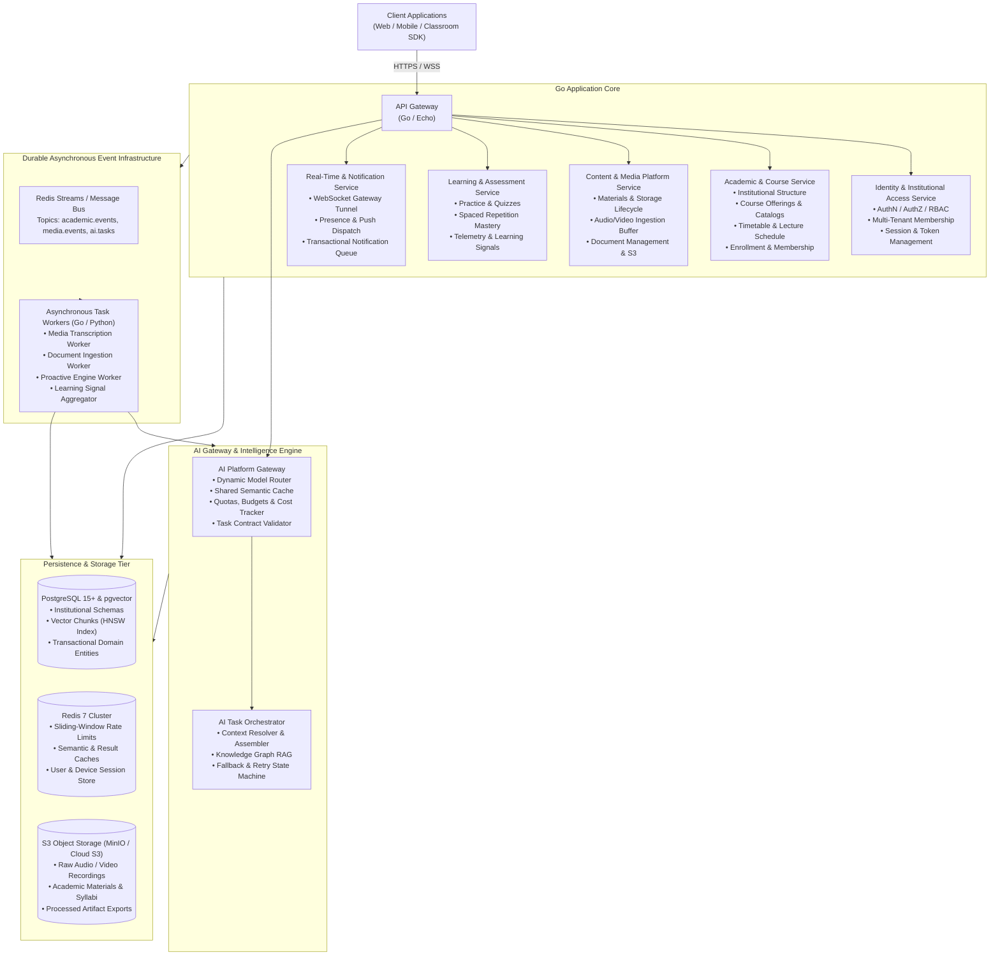
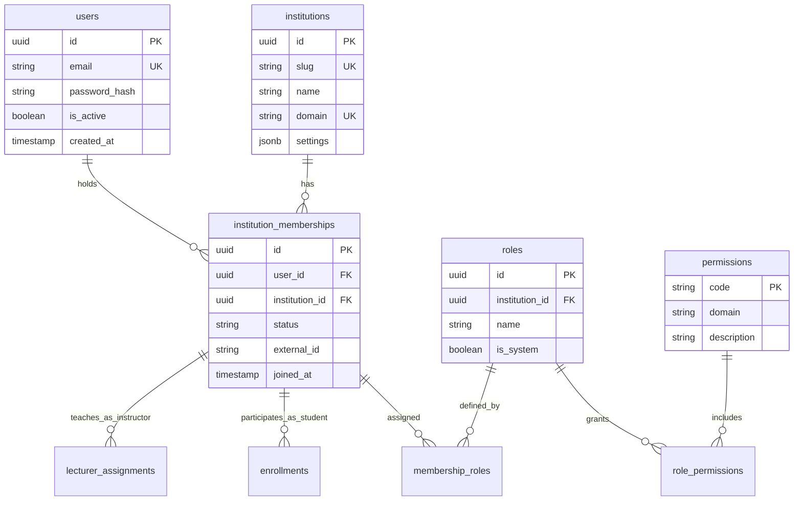
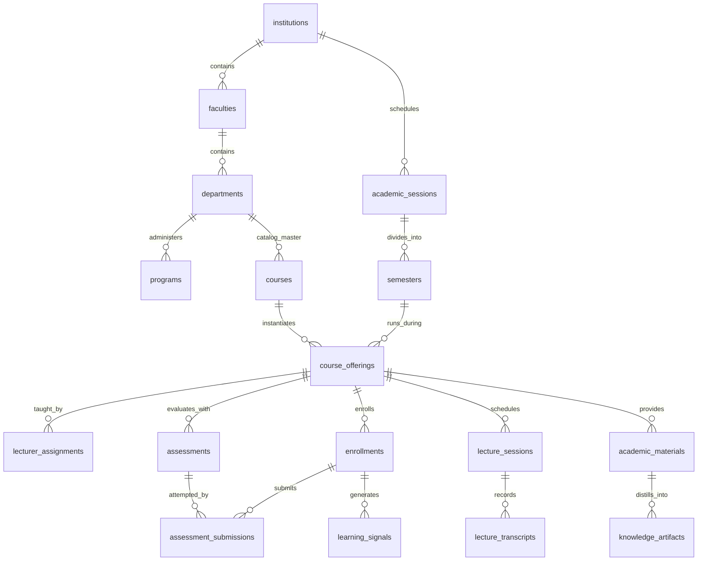
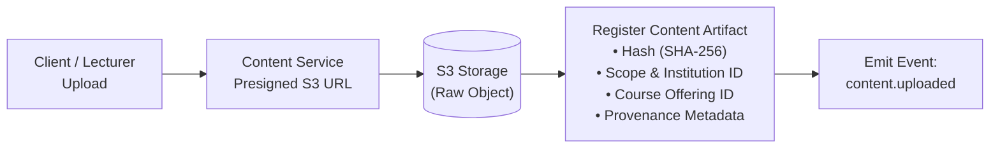
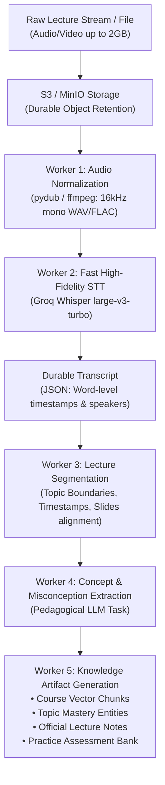

# Zuri — Target System Technical Specification

**Document Version:** 1.0.0  
**Status:** Canonical Engineering Contract  
**Target Milestone:** Production-Ready Institutional Intelligence Platform  
**Target Repository:** `/workspaces/Backend_lexi`  
**Product Identity:** **Zuri** (Spelled Z-U-R-I)  

---

## 1. Product Definition & Operating Philosophy

### 1.1 Product Definition
**Zuri** is an **Academic Institutional Intelligence System** that continuously understands the academic lives of students, lecturers, and universities and proactively turns that context into useful action.

Zuri is fundamentally **not** a chatbot, a quiz generator, a flashcard maker, a note-taking app, or a collection of AI utilities. Those are ephemeral operational capabilities. The system itself is an institutional intelligence platform whose fundamental unit of context is the **academic institution and its structured learning activities**.

### 1.2 The Central System Principle
> **"Given everything Zuri currently knows, what would be genuinely useful to this person right now?"**

- If there is nothing useful: **Zuri remains silent.**
- If a class is approaching: Zuri knows the syllabus, previous lecture notes, and unresolved student questions.
- If a student struggled with a previous topic: Zuri tracks that knowledge gap and adapts practice materials.
- If a lecture has just concluded: Zuri ingests audio/slides, extracts key concepts, and generates structured notes.
- If multiple students in a cohort stumble on the same concept: Zuri surfaces an aggregated, anonymized signal to the lecturer.
- If institutional course knowledge can answer a query: Zuri cites the authoritative course material.

The system is **context-driven and event-driven**, rather than screen-driven or prompt-reactive.

### 1.3 Target Architectural Philosophy
The architecture optimizes for:
1. **Correctness & Referential Integrity**: Academic records, grades, and knowledge provenance must be structurally sound.
2. **Zero-Trust Institutional Multi-Tenancy**: Data separation across universities, faculties, and courses is enforced at every layer.
3. **Decoupled Domain Boundaries**: Logical domain boundaries precede physical microservice separation.
4. **AI-Provider Agnosticism**: No core business domain may import or depend directly on any specific LLM provider SDK.
5. **Durable Academic State**: Media, transcripts, chunks, concept graphs, and learning signals must outlive individual AI model lifetimes.
6. **Cost & Computation Efficiency**: High-volume computations (transcription, document chunking, concept extraction) are computed once and shared safely across all enrolled students.

---

## 2. Target Physical Topology & Logical Domains

### 2.1 Logical Domains (15 Core Domains)

```
+---------------------------------------------------------------------------------------------------------+
|                                           ZURI LOGICAL DOMAINS                                          |
+-------------------+-------------------+-------------------+---------------------+-----------------------+
| 1. Identity       | 2. Institution    | 3. Academic       | 4. Scheduling       | 5. Courses & Content  |
| IAM, Credentials, | Tenants, Campuses,| Programs, Levels, | Timetables, Terms,  | Catalogs, Syllabi,    |
| Sessions, AuthN   | Governance, Org   | Cohorts, Degrees  | Lectures, Sessions  | Materials, Artifacts  |
+-------------------+-------------------+-------------------+---------------------+-----------------------+
| 6. Media Platform | 7. Knowledge      | 8. Learning Signal| 9. AI Engine        | 10. Research Suite    |
| Audio Streaming,  | Concepts, Topics, | Mastery, Practice,| Tasks, Gateway,     | Literature, Papers,   |
| Transcripts, Video| Provenance Graphs | Quizzes, Feedback | Routing, Prompts    | Synthesis, Citations  |
+-------------------+-------------------+-------------------+---------------------+-----------------------+
| 11. Proactive     | 12. Notification  | 13. Analytics     | 14. Administration  | 15. Security & Audit  |
| Context Evaluator,| Multi-Channel,    | Cohort Trends,    | University Ops,     | Tenant Isolation,     |
| Academic Triggers | Quiet Hours, Push | Institutional ROI | Integrations, Logs  | RBAC, Compliance      |
+-------------------+-------------------+-------------------+---------------------+-----------------------+
```

### 2.2 Target Physical Architecture



---

## 3. Target Identity, Membership & Multi-Tenancy (IAM)

### 3.1 Decoupled Identity Model
Identity is strictly decoupled from institutional roles:
$$\text{User} \longrightarrow \text{Membership} \longrightarrow \text{Institution} \longrightarrow \text{Role} \longrightarrow \text{Permissions}$$

A single human user possesses a persistent identity record that may hold multiple memberships across institutions (e.g., an adjunct lecturer at University A who is concurrently a doctoral student at University B).



### 3.2 Authorization Contract (ABAC + RBAC)
Authorization is never evaluated solely on string matching (e.g. `user.role == "admin"`). Every request is evaluated against:
$$\text{AuthZ} = f(\text{Subject}, \text{Action}, \text{Resource}, \text{Context})$$
- **Subject**: Authenticated user ID, active institutional membership, assigned roles, effective permissions.
- **Action**: Read, Write, Update, Delete, Execute, Grade, Ingest, Export.
- **Resource**: Target entity type, entity ID, owning institution ID, course offering ID, privacy scope.
- **Context**: Request IP, token freshness, semester active state, enrollment status.

### 3.3 Multi-Tenant Resource Scoping Matrix
Every domain entity in Zuri declares an explicit resource scope:

| Scope Level | Scope Meaning | Access Rules |
| :--- | :--- | :--- |
| `global` | System-wide configuration | Super-administrators only. |
| `institution` | University-wide assets | Any authenticated member of the specific institution. |
| `faculty` | College / Faculty governance | Members affiliated with departments within the faculty. |
| `department` | Academic department catalog | Department lecturers, staff, and enrolled students. |
| `program` | Degree curriculum & requirements | Students enrolled in the specific degree track. |
| `course` | Master syllabus & catalog course | All instructors and students in any offering of this course. |
| `course_offering` | Active semester section/cohort | Strictly students enrolled in the offering and assigned lecturers. |
| `lecture_session` | Individual scheduled timetable class | Attendees of the specific lecture. |
| `personal` | Student notes, draft attempts | The individual creator only. |

---

## 4. Target Academic Data Architecture

### 4.1 Canonical Institutional Hierarchy
The academic domain model establishes strict 1-to-N referential integrity across 15 institutional tiers:

$$\text{Institution} \to \text{Faculty} \to \text{Department} \to \text{Program} \to \text{Academic Session} \to \text{Semester} \to \text{Level} \to \text{Course} \to \text{Course Offering} \to \text{Class/Lecture} \to \text{Enrollment} \to \text{Material} \to \text{Assessment} \to \text{Learning Signal} \to \text{Knowledge}$$



### 4.2 Entity Specifications & Invariants

#### `courses` (Catalog Master)
- `id` (UUID, PK)
- `institution_id` (UUID, FK `institutions.id`, NOT NULL)
- `department_id` (UUID, FK `departments.id`, NOT NULL)
- `code` (VARCHAR(20), NOT NULL, e.g. `"CSC 201"`)
- `title` (VARCHAR(255), NOT NULL)
- `credit_units` (INTEGER, NOT NULL)
- `description` (TEXT)
- **Invariant**: `UNIQUE(institution_id, code)`

#### `course_offerings` (Active Academic Cohort)
- `id` (UUID, PK)
- `course_id` (UUID, FK `courses.id`, NOT NULL)
- `semester_id` (UUID, FK `semesters.id`, NOT NULL)
- `section` (VARCHAR(10), NOT NULL, e.g. `"Section A"`)
- `status` (ENUM: `'draft'`, `'open'`, `'in_progress'`, `'completed'`, `'archived'`)
- **Invariant**: `UNIQUE(course_id, semester_id, section)`

#### `enrollments`
- `id` (UUID, PK)
- `course_offering_id` (UUID, FK `course_offerings.id`, NOT NULL)
- `student_membership_id` (UUID, FK `institution_memberships.id`, NOT NULL)
- `enrollment_type` (ENUM: `'credit'`, `'audit'`, `'repeat'`)
- `status` (ENUM: `'enrolled'`, `'dropped'`, `'withdrawn'`, `'completed'`)
- **Invariant**: `UNIQUE(course_offering_id, student_membership_id)`

---

## 5. Target Content, Media & Knowledge Extraction Pipeline

### 5.1 Content Lifecycle & Provenance Model
Academic content artifacts never exist as orphaned blobs. Every artifact maintains strict provenance:



Every `academic_material` artifact tracks:
- `provenance_type`: `'instructor_upload'`, `'lecture_recording'`, `'curriculum_syllabus'`, `'student_submission'`, `'ai_derived_summary'`.
- `source_artifact_id`: Points to parent artifact if derived (e.g. an AI summary points to the original PDF).
- `version`: Monotonically increasing document revision.
- `content_hash`: SHA-256 digest of original binary.

### 5.2 The Lecture Media Pipeline
Lecture recordings are processed asynchronously through a durable, multi-stage pipeline:

$$\text{Upload} \to \text{Storage} \to \text{Audio Transcode} \to \text{Transcription} \to \text{Segmentation} \to \text{Pedagogical Analysis} \to \text{Knowledge Graph} \to \text{Study Artifacts}$$



### 5.3 Resilience & Failure Boundaries
1. **Durable Media State**: Transcription failure does not discard raw audio. Raw media is preserved indefinitely under S3 lifecycle policies.
2. **Deterministic Chunker**: Chunks are generated with stable UUIDv5 keys:
   $$\text{chunk\_id} = \text{UUIDv5}(\text{NAMESPACE\_URL}, \text{material\_id} + "::chunk::" + \text{index})$$
3. **Idempotent Ingestion**: Re-running ingestion on an identical SHA-256 hash checks database presence and skips redundant embedding computations.

---

## 6. Target Knowledge, Retrieval & Vector System

### 6.1 Unified Vector Architecture
- **Embedding Standard**: Standardized on a single multi-lingual embedding model across all ingestion and retrieval paths (e.g., Cohere `embed-multilingual-v3.0` or Google `text-embedding-004`).
- **Vector Dimensions**: Fixed at **1024 dimensions** (or **768 dimensions**), eliminating multi-dimension schema clashes.
- **Table Schema**:
  ```sql
  CREATE TABLE knowledge.document_chunks (
      id UUID PRIMARY KEY DEFAULT gen_random_uuid(),
      institution_id UUID NOT NULL REFERENCES institutions(id),
      course_id UUID REFERENCES courses(id),
      material_id UUID NOT NULL REFERENCES academic_materials(id) ON DELETE CASCADE,
      chunk_index INTEGER NOT NULL,
      chunk_text TEXT NOT NULL,
      tsv_content TSVECTOR GENERATED ALWAYS AS (to_tsvector('english', chunk_text)) STORED,
      embedding VECTOR(1024) NOT NULL,
      metadata JSONB NOT NULL DEFAULT '{}'::jsonb,
      created_at TIMESTAMPTZ NOT NULL DEFAULT NOW()
  );

  CREATE INDEX idx_chunks_hnsw ON knowledge.document_chunks USING hnsw (embedding vector_cosine_ops)
      WITH (m = 16, ef_construction = 64);
  CREATE INDEX idx_chunks_tsv ON knowledge.document_chunks USING gin (tsv_content);
  CREATE INDEX idx_chunks_scope ON knowledge.document_chunks (institution_id, course_id);
  ```

### 6.2 Hybrid Search with Reciprocal Rank Fusion (RRF)
Vector similarity alone misses exact academic terminology (course codes, equations, medical terms). Zuri mandates **Hybrid Search**:
1. **Semantic Vector Search**: pgvector cosine distance (`<=>`) retrieving top $K_v$ candidates.
2. **Lexical Full-Text Search**: PostgreSQL `tsvector` with `ts_rank_cd` retrieving top $K_t$ candidates.
3. **Reciprocal Rank Fusion**: Merges ranks using:
   $$RRF\_Score(d) = \sum_{m \in \{vec, lex\}} \frac{1}{60 + \text{Rank}_m(d)}$$
4. **Tenant Scoping Guard**: Every query strictly appends `WHERE institution_id = :tenant_id AND (scope = 'institution' OR course_id = :course_id)`.

---

## 7. Target AI Engine & Task Architecture

### 7.1 AI System Topology

```
Application Layer
       ↓
API Gateway (Rate limit, AuthZ, Dedup)
       ↓
AI Platform Gateway (Task Contract Validation, Tenant Quotas, Cost Tracker)
       ↓
Context Resolver (Scoped Retrieval, Concept Lookup, User Learning State)
       ↓
Shared Semantic & Request Cache (Redis)
       ↓
Model Router (Task Requirements, Quality vs. Cost, Modality)
       ↓
Provider Adapters (Google Gemini, Groq Whisper, Institutional / Local Models)
```

### 7.2 Explicit AI Task Contracts
No application controller writes ad-hoc prompts. Every AI interaction is formulated as a strongly typed **AI Task**:

| Task Code | Input Contract | Context Injected | Output Contract | Target Model Tier |
| :--- | :--- | :--- | :--- | :--- |
| `TRANSCRIBE_AUDIO` | Audio stream / chunk | Language hint, vocabulary glossary | JSON with text, segments, timestamps | Groq Whisper / Faster-Whisper |
| `SUMMARIZE_LECTURE` | Lecture transcript | Course syllabus, previous lecture concepts | Structured Markdown (Overview, Concepts, Analogies) | Balanced (`gemini-2.5-flash`) |
| `EXTRACT_CONCEPTS` | Document / Transcript | Course topic taxonomy | JSON array of `{ concept, definition, prerequisites }` | Reasoning (`gemini-2.5-pro`) |
| `GENERATE_ASSESSMENT`| Chunk excerpts, topic | Bloom's taxonomy level, target mark count | JSON array of MCQs / Theory with Rubric | Balanced (`gemini-2.5-flash`) |
| `EXPLAIN_CONCEPT` | Student question, context | Student mastery state, knowledge gaps | Adaptive Markdown pedagogical explanation | Fast (`gemini-2.5-flash-lite`) |
| `DETECT_GAPS` | Quiz answers, time taken | Target course learning outcomes | JSON array of `{ topic, gap_severity, recommendation }` | Reasoning (`gemini-2.5-pro`) |

### 7.3 Shared vs. Personalized AI Cost Architecture
To prevent exponential cloud API costs as institutional enrollment scales, Zuri differentiates:

1. **Shared Computation (Compute Once, Benefit All)**:
   - Lecture audio transcription and summarization.
   - Course material PDF parsing, chunking, and embedding generation.
   - Core concept extraction and official exam practice banks.
   - *Strategy*: Executed once upon instructor upload/lecture end. Persisted to database and cached indefinitely in Redis (`cache:shared:{institution_id}:{course_id}:{artifact_id}`).
2. **Personalized Computation (On-Demand & Scoped)**:
   - Student interactive Q&A tutoring.
   - Personalized knowledge-gap remediation plans.
   - Dynamic flashcard review generation tailored to individual past mistakes.
   - *Strategy*: Subject to strict user quotas, sliding-window rate limits, and per-task cost logging.

---

## 8. Target Proactive Engine & Student Experience

### 8.1 The "Today" Engine
The primary student surface in Zuri is **Today** — a timeline that answers:
> *"What matters academically right now?"*

```
+---------------------------------------------------------------------------------------+
|                                    ZURI TODAY TIMELINE                                |
+---------------------------------------------------------------------------------------+
| NOW          | Lecture: CSC 201 — Data Structures (Hall B, Started 15m ago)           |
|              | • Audio stream active • Live transcription available                   |
+--------------+------------------------------------------------------------------------+
| NEXT         | 14:00 — MAT 203 (Differential Equations)                               |
|              | • 5m Prep Brief: Review "Separable Equations" from last Tuesday        |
+--------------+------------------------------------------------------------------------+
| UNRESOLVED   | Knowledge Gap: Binary Search Tree Balancing                            |
|              | • You missed 2 questions on Tuesday's self-test. 3-minute practice ready.|
+--------------+------------------------------------------------------------------------+
| DEADLINES    | Friday, 23:59 — CSC 201 Lab Report 1 (3 days remaining)                |
+---------------------------------------------------------------------------------------+
```

### 8.2 Proactive Engine Evaluation Loop
An event-driven evaluator determines interventions using the rule:
$$\text{Intervene} \iff \text{Confidence} \ge \theta \land \text{Urgency} \ge \mu \land \text{QuietHours} = \text{False} \land \text{FatigueGuard} = \text{Clear}$$

If the conditions are not satisfied, **Zuri takes zero action**. Zuri rejects spammy, repetitive reminders.

---

## 9. Target Lecturer & Institutional Intelligence

### 9.1 Lecturer Intelligence Dashboard
Lecturers receive aggregated, actionable course signals without exposing private student records:
- **Cohort Misconception Alerts**: *"42% of students in CSC 201 struggled with Pointer Arithmetic in yesterday's practice assessment."*
- **Lecture Resonance Index**: Identifies which 10-minute segments of a lecture generated the highest density of student questions or re-listens.
- **Automated Revision Material**: One-click generation of review problem sets targeting the exact concepts where the class showed weakness.

### 9.2 Institutional Governance & Oversight
University administrators have access to:
- **Institutional Onboarding & Identity**: Bulk SIS/LMS integration (LTI 1.3, Canvas, Blackboard, Moodle, CSV rostering).
- **Audit Logging**: Immutable, tamper-evident audit trails for all grade events, access attempts, and administrative actions.
- **AI Cost & Resource Governance**: Per-department AI budget enforcement, token consumption telemetry, and model performance metrics.

---

## 10. Target Security, Resilience & Database Principles

### 10.1 Security Invariants
1. **No Cryptographic Shortcuts**: All password hashing uses bcrypt cost 12+. All token signing uses RS256 with key rotation. All private keys are encrypted at rest with AES-256-GCM.
2. **Zero Insecure Object Direct References (IDOR)**: Handlers never update or fetch resources using client-supplied IDs without verifying ownership or institutional permission in the same database transaction.
3. **No Unverified JWT Parsing**: Every service validates token signatures against the institutional public key or verifies an authenticated internal gateway signature (`X-Internal-Key`).
4. **Internal Network Isolation**: Downstream microservice ports are closed to external networks; only the API Gateway (`:8080`) is exposed externally.

### 10.2 Database Design Standards
- **Explicit Schema Segregation**: Every service operates within its explicit schema namespace: `zuri_auth`, `zuri_academic`, `zuri_content`, `zuri_knowledge`, `zuri_learning`, `zuri_analytics`, `zuri_sync`, `zuri_notification`.
- **Soft Deletes with Audit Trail**: Critical academic records (courses, enrollments, grades) use `deleted_at` timestamps with deleted-by audit pointers.
- **No Large Blobs in PostgreSQL**: Binary media, audio chunks, and base64 strings are stored exclusively in S3 object storage; only URLs and metadata hashes reside in relational tables.
- **Database Connection Pooling**: Explicit pool sizing (`MaxOpenConns: 25`, `MaxIdleConns: 5`) and exponential backoff retry loops on all database connectors.
